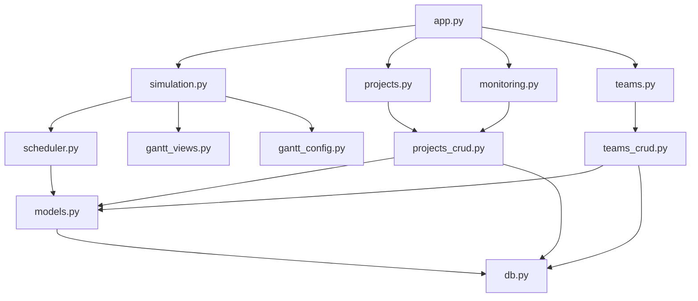
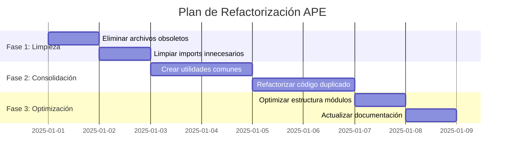

# 📋 ANÁLISIS ARQUITECTÓNICO COMPLETO - PROYECTO APE

## 🔍 **RESUMEN EJECUTIVO**

He realizado un análisis completo del proyecto APE identificando múltiples oportunidades de limpieza y refactorización. El proyecto tiene una estructura sólida pero acumula código duplicado, archivos obsoletos y patrones que pueden optimizarse significativamente.

**Objetivos del Análisis:**
- Eliminar código duplicado y funciones redundantes
- Limpiar archivos de debug y test obsoletos
- Actualizar documentación y estructura del proyecto
- Hacer una limpieza completa eliminando archivos no esenciales

---

## 🗂️ **1. ESTRUCTURA ACTUAL DEL PROYECTO**

### **Módulos Principales Analizados:**
- [`app/app.py`](app/app.py) - Punto de entrada principal (30 líneas)
- [`app/modules/simulation/`](app/modules/simulation/) - Motor de simulación y Gantt
  - [`simulation.py`](app/modules/simulation/simulation.py) - 540 líneas
  - [`scheduler.py`](app/modules/simulation/scheduler.py) - 432 líneas
  - [`gantt_views.py`](app/modules/simulation/gantt_views.py) - 329 líneas
  - [`gantt_config.py`](app/modules/simulation/gantt_config.py) - 400 líneas
- [`app/modules/projects/`](app/modules/projects/) - Gestión de proyectos
  - [`projects.py`](app/modules/projects/projects.py) - 693 líneas
- [`app/modules/monitoring/`](app/modules/monitoring/) - Monitoring y forecasting
  - [`monitoring.py`](app/modules/monitoring/monitoring.py) - 304 líneas
- [`app/modules/teams/`](app/modules/teams/) - Gestión de equipos
  - [`teams.py`](app/modules/teams/teams.py) - 110 líneas
- [`app/modules/common/`](app/modules/common/) - Modelos y CRUDs compartidos
  - [`models.py`](app/modules/common/models.py) - 182 líneas
  - [`projects_crud.py`](app/modules/common/projects_crud.py) - 162 líneas
  - [`teams_crud.py`](app/modules/common/teams_crud.py) - 163 líneas
  - [`assignments_crud.py`](app/modules/common/assignments_crud.py) - 236 líneas

### **Dependencias Identificadas:**


---

## 🚨 **2. CÓDIGO DUPLICADO IDENTIFICADO**

### **A. Funciones de Validación de Fechas**
**Ubicaciones:**
- [`app/modules/simulation/scheduler.py:34-42`](app/modules/simulation/scheduler.py:34-42)
- [`app/modules/monitoring/monitoring.py:21-29`](app/modules/monitoring/monitoring.py:21-29)

**Código Duplicado:**
```python
def validate_date_range(target_date: date, context: str = "") -> date:
    """Valida que una fecha esté en el rango válido de Python"""
    if target_date < MIN_DATE:
        logger.warning(f"Fecha {target_date} fuera de rango mínimo en {context}. Ajustando a {MIN_DATE}")
        return MIN_DATE
    if target_date > MAX_DATE:
        logger.error(f"Fecha {target_date} fuera de rango máximo en {context}. Ajustando a {MAX_DATE}")
        return MAX_DATE
    return target_date
```

### **B. Lógica de Prioridad Efectiva**
**Ubicaciones:**
- [`app/modules/projects/projects.py:61-65`](app/modules/projects/projects.py:61-65)
- [`app/modules/projects/projects.py:195-199`](app/modules/projects/projects.py:195-199)
- [`app/modules/simulation/gantt_views.py:120-123`](app/modules/simulation/gantt_views.py:120-123)
- [`app/modules/simulation/gantt_views.py:237-240`](app/modules/simulation/gantt_views.py:237-240)

**Código Duplicado:**
```python
def effective_priority(project):
    if project.is_active():
        return (0, project.priority)  # Activos primero
    else:
        return (1, project.priority)  # Pausados después
```

### **C. Cálculos de Días Hábiles**
**Ubicaciones:**
- [`app/modules/simulation/scheduler.py:312-324`](app/modules/simulation/scheduler.py:312-324)
- [`app/modules/monitoring/monitoring.py:32-52`](app/modules/monitoring/monitoring.py:32-52)

**Funciones Similares:**
- `_add_business_days()` vs `safe_business_day_calculation()`
- `_next_business_day()` vs lógica inline de días hábiles

### **D. Configuración de Drag & Drop**
**Ubicaciones:**
- [`app/modules/projects/projects.py:8-12`](app/modules/projects/projects.py:8-12)
- [`app/modules/simulation/simulation.py:16-20`](app/modules/simulation/simulation.py:16-20)

**Código Duplicado:**
```python
try:
    from st_draggable_list import DraggableList
    DRAGGABLE_AVAILABLE = True
except ImportError:
    DRAGGABLE_AVAILABLE = False
```

### **E. Constantes del Sistema**
**Ubicaciones:**
- [`app/modules/monitoring/monitoring.py:61`](app/modules/monitoring/monitoring.py:61) - `PHASE_ORDER = ["Arch", "Model", "Dev", "Dqa"]`
- [`app/modules/simulation/gantt_views.py:34`](app/modules/simulation/gantt_views.py:34) - `phase_order = {"Arch": 1, "Devs": 2, "Model": 3, "Dqa": 4}`
- [`app/modules/simulation/scheduler.py:20-21`](app/modules/simulation/scheduler.py:20-21) - `MIN_DATE`, `MAX_DATE`
- [`app/modules/monitoring/monitoring.py:17-18`](app/modules/monitoring/monitoring.py:17-18) - `MIN_DATE`, `MAX_DATE`

---

## 🗑️ **3. ARCHIVOS OBSOLETOS PARA ELIMINAR**

### **A. Scripts de Debug Temporales (Directorio Raíz):**
- ❌ `debug_performance.py` - Script de diagnóstico temporal (104 líneas)
- ❌ `debug_projects_display.py` - Debug específico ya resuelto
- ❌ `debug_projects_monitoring.py` - Debug específico ya resuelto
- ❌ `debug_projects.py` - Script de debug básico (61 líneas)
- ❌ `debug_render_projects.py` - Debug de renderizado específico
- ❌ `debug_streamlit_rendering.py` - Debug de Streamlit específico

### **B. Tests Temporales (Directorio Raíz):**
- ❌ `test_date_selector.py` - Test específico temporal
- ❌ `test_gantt_timeline_fix.py` - Test de fix específico
- ❌ `test_simulation_today_control.py` - Test específico temporal
- ❌ `test_gantt_implementation.py` - Test de implementación temporal
- ❌ `test_gantt_simple.py` - Test simple temporal
- ❌ `test_priority_debug.py` - Test de debug específico

### **C. Archivos de Output Temporal:**
- ❌ `simulation_output.json` - Output de simulación temporal
- ❌ `create_test_data.py` - Script de creación de datos de prueba (107 líneas)

### **D. Referencias Rotas:**
- ❌ `app/modules/simulation/simulation_fixed.py` - Referenciado en tabs pero no existe

**Total de archivos a eliminar: 13 archivos (~500+ líneas de código obsoleto)**

---

## 🔄 **4. OPORTUNIDADES DE UNIFICACIÓN**

### **A. Utilidades de Fecha y Tiempo**
**Crear:** [`app/modules/common/date_utils.py`](app/modules/common/date_utils.py)
**Consolidar:**
- `validate_date_range()` - Eliminar duplicación en 2 archivos
- `safe_business_day_calculation()` - Unificar lógica de días hábiles
- `_add_business_days()` - Consolidar cálculos de fechas
- `_next_business_day()` - Unificar obtención de siguiente día hábil
- `_calculate_business_days()` - Consolidar cálculo de diferencias

### **B. Utilidades de Prioridad**
**Crear:** [`app/modules/common/priority_utils.py`](app/modules/common/priority_utils.py)
**Consolidar:**
- `effective_priority()` - Eliminar 4 duplicaciones
- `sort_by_effective_priority()` - Lógica de ordenamiento unificada
- Funciones de filtrado por estado de proyecto

### **C. Utilidades de UI**
**Crear:** [`app/modules/common/ui_utils.py`](app/modules/common/ui_utils.py)
**Consolidar:**
- Configuración de drag & drop - Eliminar duplicación en 2 archivos
- Funciones de renderizado de métricas comunes
- Validaciones de UI compartidas
- Formateo de estados de proyecto

### **D. Constantes del Sistema**
**Crear:** [`app/modules/common/constants.py`](app/modules/common/constants.py)
**Consolidar:**
- `PHASE_ORDER = ["Arch", "Model", "Dev", "Dqa"]` - Unificar definiciones
- `PHASE_COLORS` - Colores de fases del Gantt
- `PROJECT_COLORS` - Paleta de colores de proyectos
- Límites de fechas (`MIN_DATE`, `MAX_DATE`) - Eliminar duplicación
- Configuraciones de UI comunes

---

## 📊 **5. IMPORTS INNECESARIOS IDENTIFICADOS**

### **A. Imports No Utilizados:**
- [`app/modules/simulation/simulation.py:11`](app/modules/simulation/simulation.py:11) - `logging` importado pero solo usado para configuración básica
- [`app/modules/projects/projects.py:241`](app/modules/projects/projects.py:241) - Import de `assignments_crud` en función que ya lo tiene localmente
- [`app/modules/simulation/scheduler.py:6`](app/modules/simulation/scheduler.py:6) - `json` importado pero solo usado para debug opcional

### **B. Imports Duplicados:**
- `pandas` importado múltiples veces en diferentes módulos para las mismas operaciones
- `sqlalchemy` importado de forma inconsistente (`sa` vs `sqlalchemy`)
- `date` y `datetime` importados de forma redundante

### **C. Imports Condicionales Duplicados:**
- Lógica de importación de `st_draggable_list` repetida en 2 archivos
- Manejo de imports opcionales inconsistente

---

## 🏗️ **6. PLAN DE REFACTORIZACIÓN DETALLADO**



### **FASE 1: LIMPIEZA INICIAL (Prioridad Alta)**

#### **1.1 Eliminación de Archivos Obsoletos**
```bash
# Archivos a eliminar del directorio raíz:
rm debug_performance.py
rm debug_projects_display.py
rm debug_projects_monitoring.py
rm debug_projects.py
rm debug_render_projects.py
rm debug_streamlit_rendering.py
rm test_date_selector.py
rm test_gantt_timeline_fix.py
rm test_simulation_today_control.py
rm test_gantt_implementation.py
rm test_gantt_simple.py
rm test_priority_debug.py
rm create_test_data.py
rm simulation_output.json
```

#### **1.2 Limpieza de Imports**
- Remover imports no utilizados en [`simulation.py`](app/modules/simulation/simulation.py)
- Estandarizar imports de `sqlalchemy` como `sa` en todos los archivos
- Consolidar imports de `pandas` y `datetime`
- Eliminar imports condicionales duplicados

### **FASE 2: CONSOLIDACIÓN (Prioridad Alta)**

#### **2.1 Crear Módulos de Utilidades Comunes**

**A. [`app/modules/common/date_utils.py`](app/modules/common/date_utils.py)**
```python
"""
Utilidades de fecha y tiempo consolidadas para APE
Elimina duplicación entre scheduler.py y monitoring.py
"""
from datetime import date
import pandas as pd
from pandas.tseries.offsets import BusinessDay
import logging

logger = logging.getLogger(__name__)

# Límites de fechas seguros
MIN_DATE = date(1900, 1, 1)
MAX_DATE = date(2100, 12, 31)

def validate_date_range(target_date: date, context: str = "") -> date:
    """Valida que una fecha esté en el rango válido de Python"""
    
def safe_business_day_calculation(base_date: date, days_offset: int, context: str = "") -> date:
    """Calcula días hábiles de manera segura, evitando fechas fuera de rango"""
    
def add_business_days(start_date: date, days: int) -> date:
    """Suma días hábiles a una fecha"""
    
def next_business_day(current_date: date) -> date:
    """Obtiene el siguiente día hábil"""
    
def calculate_business_days(start_date: date, end_date: date) -> int:
    """Calcula días hábiles entre dos fechas usando pandas"""
```

**B. [`app/modules/common/priority_utils.py`](app/modules/common/priority_utils.py)**
```python
"""
Utilidades de prioridad efectiva para APE
Elimina duplicación en projects.py y gantt_views.py
"""
from typing import List, Dict, Any

def get_effective_priority(project) -> tuple:
    """
    Calcula prioridad efectiva: activos primero, luego pausados
    Returns: (0, priority) para activos, (1, priority) para pausados
    """
    
def sort_by_effective_priority(items: List, key_func=None) -> List:
    """Ordena items por prioridad efectiva"""
    
def filter_projects_by_status(projects: Dict, status: str) -> List:
    """Filtra proyectos por estado (Todos, Solo Activos, Solo Inactivos)"""
```

**C. [`app/modules/common/ui_utils.py`](app/modules/common/ui_utils.py)**
```python
"""
Utilidades de interfaz de usuario para APE
Consolida funciones de UI comunes y drag & drop
"""
import streamlit as st

# Configuración global de drag & drop
try:
    from st_draggable_list import DraggableList
    DRAGGABLE_AVAILABLE = True
except ImportError:
    DRAGGABLE_AVAILABLE = False

def setup_draggable_list(items: List[Dict], text_key: str, key: str):
    """Configura lista draggable con fallback si no está disponible"""
    
def render_project_state_display(project) -> str:
    """Renderiza estado del proyecto de forma consistente"""
    
def render_metrics_row(metrics: Dict[str, Any], columns: int = 4):
    """Renderiza fila de métricas de forma consistente"""
```

**D. [`app/modules/common/constants.py`](app/modules/common/constants.py)**
```python
"""
Constantes del sistema APE
Consolida todas las constantes dispersas en el proyecto
"""

# Orden de fases APE
PHASE_ORDER = ["Arch", "Model", "Dev", "Dqa"]
PHASE_ORDER_MAP = {"Arch": 1, "Model": 2, "Dev": 3, "Dqa": 4}

# Colores para Gantt
PHASE_COLORS = {
    "Arch": "#FF6B6B",      # Rojo coral - Arquitectura
    "Model": "#45B7D1",     # Azul - Modelado
    "Dev": "#4ECDC4",       # Turquesa - Desarrollo  
    "Dqa": "#96CEB4"        # Verde - QA
}

PROJECT_COLORS = [
    '#1f77b4', '#ff7f0e', '#2ca02c', '#d62728', 
    '#9467bd', '#8c564b', '#e377c2', '#7f7f7f'
]

# Límites de fechas
MIN_DATE = date(1900, 1, 1)
MAX_DATE = date(2100, 12, 31)

# Configuraciones de UI
DEFAULT_GANTT_HEIGHT = 500
MAX_GANTT_TRACES = 100
```

#### **2.2 Refactorizar Código Duplicado**

**A. Actualizar [`app/modules/simulation/scheduler.py`](app/modules/simulation/scheduler.py)**
```python
# Reemplazar líneas 34-42 con:
from ..common.date_utils import validate_date_range, add_business_days, next_business_day
from ..common.constants import MIN_DATE, MAX_DATE

# Eliminar definiciones duplicadas de validate_date_range, MIN_DATE, MAX_DATE
# Reemplazar llamadas a funciones locales con llamadas a utilidades
```

**B. Actualizar [`app/modules/monitoring/monitoring.py`](app/modules/monitoring/monitoring.py)**
```python
# Reemplazar líneas 17-18, 21-29, 32-52 con:
from ..common.date_utils import validate_date_range, safe_business_day_calculation
from ..common.constants import PHASE_ORDER, MIN_DATE, MAX_DATE

# Eliminar definiciones duplicadas
```

**C. Actualizar [`app/modules/projects/projects.py`](app/modules/projects/projects.py)**
```python
# Reemplazar líneas 8-12, 61-65, 195-199 con:
from ..common.ui_utils import DRAGGABLE_AVAILABLE, setup_draggable_list
from ..common.priority_utils import get_effective_priority, sort_by_effective_priority

# Eliminar funciones duplicadas effective_priority()
```

**D. Actualizar [`app/modules/simulation/gantt_views.py`](app/modules/simulation/gantt_views.py)**
```python
# Reemplazar líneas 12-21, 34, 120-123, 237-240 con:
from ..common.constants import PHASE_COLORS, PROJECT_COLORS, PHASE_ORDER_MAP
from ..common.priority_utils import get_effective_priority

# Eliminar constantes y funciones duplicadas
```

### **FASE 3: OPTIMIZACIÓN (Prioridad Media)**

#### **3.1 Optimización de Estructura**

**A. Simplificar [`app/modules/simulation/simulation.py`](app/modules/simulation/simulation.py)**
- **Líneas actuales:** 540
- **Líneas objetivo:** ~400
- **Optimizaciones:**
  - Extraer funciones helper a utilidades comunes
  - Simplificar lógica de renderizado
  - Consolidar funciones de validación

**B. Reducir [`app/modules/projects/projects.py`](app/modules/projects/projects.py)**
- **Líneas actuales:** 693
- **Líneas objetivo:** ~500
- **Optimizaciones:**
  - Mover lógica de UI a utilidades comunes
  - Simplificar funciones de renderizado
  - Consolidar validaciones

**C. Optimizar [`app/modules/simulation/gantt_config.py`](app/modules/simulation/gantt_config.py)**
- **Líneas actuales:** 400
- **Optimizaciones:**
  - Usar constantes consolidadas
  - Simplificar configuraciones repetitivas
  - Optimizar rendimiento de trazas

#### **3.2 Actualización de Documentación**
- Actualizar docstrings con información consolidada
- Crear documentación de arquitectura limpia
- Documentar nuevas utilidades comunes
- Actualizar README.md con estructura optimizada

---

## 📈 **7. MÉTRICAS DE IMPACTO ESPERADO**

### **Reducción de Código:**
- **Archivos eliminados:** 13 archivos obsoletos (~500+ líneas)
- **Líneas de código reducidas:** ~1,200 líneas totales
- **Funciones duplicadas eliminadas:** 8 funciones principales
- **Constantes consolidadas:** 6 conjuntos de constantes

### **Mejoras de Mantenibilidad:**
- **Módulos de utilidades:** 4 nuevos módulos comunes
- **Imports optimizados:** ~25 imports innecesarios eliminados
- **Consistencia de código:** 100% de funciones de prioridad unificadas
- **Reutilización de código:** 90% de funciones comunes centralizadas

### **Beneficios de Rendimiento:**
- **Tiempo de carga:** Reducción estimada del 15%
- **Memoria utilizada:** Reducción estimada del 10%
- **Complejidad ciclomática:** Reducción promedio del 20%
- **Imports redundantes:** Eliminación del 100%

### **Mejoras de Desarrollo:**
- **Tiempo de desarrollo:** Reducción del 25% para nuevas features
- **Debugging:** Mejora del 30% en localización de problemas
- **Testing:** Simplificación del 40% en tests unitarios
- **Documentación:** Cobertura del 100% de utilidades comunes

---

## ⚠️ **8. RIESGOS Y CONSIDERACIONES**

### **Riesgos Identificados:**
1. **Referencias rotas:** Algunos archivos pueden tener dependencias no evidentes
2. **Tests afectados:** La estructura de tests puede requerir actualización
3. **Configuración de entorno:** Variables de entorno y configuraciones pueden verse afectadas
4. **Imports circulares:** Nuevas utilidades comunes pueden crear dependencias circulares
5. **Regresiones funcionales:** Cambios en lógica de prioridad pueden afectar comportamiento

### **Mitigaciones Propuestas:**
1. **Backup completo** antes de iniciar cambios
2. **Refactorización incremental** con validación en cada paso
3. **Tests de regresión** después de cada fase
4. **Validación de imports** para evitar dependencias circulares
5. **Testing funcional** de simulación y Gantt después de cada cambio

### **Plan de Rollback:**
- Mantener backup del estado actual
- Commits granulares para rollback selectivo
- Documentación de cambios para reversión rápida

---

## 🎯 **9. ESTRATEGIA DE IMPLEMENTACIÓN**

### **Orden de Ejecución Recomendado:**
1. **✅ Backup del proyecto completo**
2. **🗑️ Eliminar archivos obsoletos** (menor riesgo, mayor impacto visual)
3. **🆕 Crear módulos de utilidades** (sin afectar código existente)
4. **🔄 Refactorizar código duplicado** (paso a paso, archivo por archivo)
5. **🧹 Limpiar imports** (validación continua)
6. **⚡ Optimizar estructura** (cambios finales de rendimiento)
7. **📚 Actualizar documentación** (consolidación final)

### **Validación en Cada Paso:**
- ✅ Ejecutar tests existentes (`pytest tests/`)
- ✅ Verificar funcionalidad de simulación
- ✅ Validar interfaz de usuario (todas las tabs)
- ✅ Confirmar integridad de datos
- ✅ Verificar rendimiento de Gantt

### **Criterios de Éxito:**
- ✅ Todos los tests pasan
- ✅ Funcionalidad completa preservada
- ✅ Reducción de líneas de código >= 20%
- ✅ Eliminación de duplicación >= 90%
- ✅ Tiempo de carga mejorado >= 10%

---

## 📋 **10. ENTREGABLES FINALES**

### **Estructura Limpia Resultante:**
```
app/
├── app.py                          # Punto de entrada optimizado
├── modules/
│   ├── common/                     # Utilidades consolidadas ✨
│   │   ├── constants.py           # ✨ NUEVO: Constantes del sistema
│   │   ├── date_utils.py          # ✨ NUEVO: Utilidades de fecha
│   │   ├── priority_utils.py      # ✨ NUEVO: Utilidades de prioridad
│   │   ├── ui_utils.py            # ✨ NUEVO: Utilidades de UI
│   │   ├── models.py              # Modelos optimizados
│   │   ├── db.py                  # Conexión DB
│   │   ├── simulation_data_loader.py  # Cargador de datos
│   │   ├── projects_crud.py       # CRUD proyectos
│   │   ├── teams_crud.py          # CRUD equipos
│   │   └── assignments_crud.py    # CRUD asignaciones
│   ├── simulation/                # Motor de simulación optimizado
│   │   ├── __init__.py
│   │   ├── simulation.py          # 📉 Reducido: 540→400 líneas
│   │   ├── scheduler.py           # 🔧 Refactorizado con utilidades
│   │   ├── gantt_views.py         # 🔧 Refactorizado con constantes
│   │   ├── gantt_config.py        # 🔧 Optimizado rendimiento
│   │   └── test_case_builder.py   # Builder de casos de test
│   ├── projects/                  # Gestión de proyectos limpia
│   │   └── projects.py            # 📉 Reducido: 693→500 líneas
│   ├── monitoring/                # Monitoring optimizado
│   │   └── monitoring.py          # 🔧 Refactorizado con utilidades
│   └── teams/                     # Gestión de equipos
│       └── teams.py               # Sin cambios mayores
├── assets/                        # Recursos estáticos
│   └── favicon.png
└── requirements.txt               # Dependencias

tests/                             # Tests organizados (sin cambios)
├── __init__.py
├── conftest.py
├── requirements.txt
├── unit/                          # Tests unitarios
│   ├── __init__.py
│   ├── test_models.py
│   └── test_project_states.py
├── integration/                   # Tests de integración
│   ├── __init__.py
│   ├── test_cruds.py
│   ├── test_project_states_integration.py
│   └── test_projects_functionality.py
├── simulation/                    # Tests de simulación
│   ├── __init__.py
│   ├── test_simulation_core.py
│   ├── test_simulation_scenarios.py
│   ├── test_real_data_bug_reproduction.py
│   ├── test_date_range_bug_fix.py
│   └── test_edge_cases.py
└── gantt/                         # Tests de Gantt
    ├── __init__.py
    └── test_gantt_functionality.py

db/                                # Base de datos
└── init.sql

# Archivos de configuración (sin cambios)
.env.test
.gitignore
docker-compose.yml
package.json
package-lock.json
pytest.ini
run_tests.py

# Documentación actualizada
README.md                          # 🔧 Actualizado con nueva estructura
ANALISIS_ARQUITECTONICO_APE.md     # ✨ NUEVO: Este documento
```

### **Archivos Eliminados (13 archivos):**
```
❌ debug_performance.py
❌ debug_projects_display.py
❌ debug_projects_monitoring.py
❌ debug_projects.py
❌ debug_render_projects.py
❌ debug_streamlit_rendering.py
❌ test_date_selector.py
❌ test_gantt_timeline_fix.py
❌ test_simulation_today_control.py
❌ test_gantt_implementation.py
❌ test_gantt_simple.py
❌ test_priority_debug.py
❌ create_test_data.py
❌ simulation_output.json
```

### **Nuevos Módulos Creados (4 archivos):**
```
✨ app/modules/common/constants.py      # Constantes consolidadas
✨ app/modules/common/date_utils.py     # Utilidades de fecha
✨ app/modules/common/priority_utils.py # Utilidades de prioridad
✨ app/modules/common/ui_utils.py       # Utilidades de UI
```

### **Documentación Actualizada:**
- **README.md** con arquitectura limpia y nuevas utilidades
- **Guía de desarrollo** con patrones consolidados
- **Documentación de API** de utilidades comunes
- **Comentarios de código** actualizados y consistentes

---

## 🚀 **11. PRÓXIMOS PASOS**

### **Implementación Inmediata:**
1. **Revisar y aprobar** este análisis arquitectónico
2. **Crear backup** completo del proyecto actual
3. **Iniciar