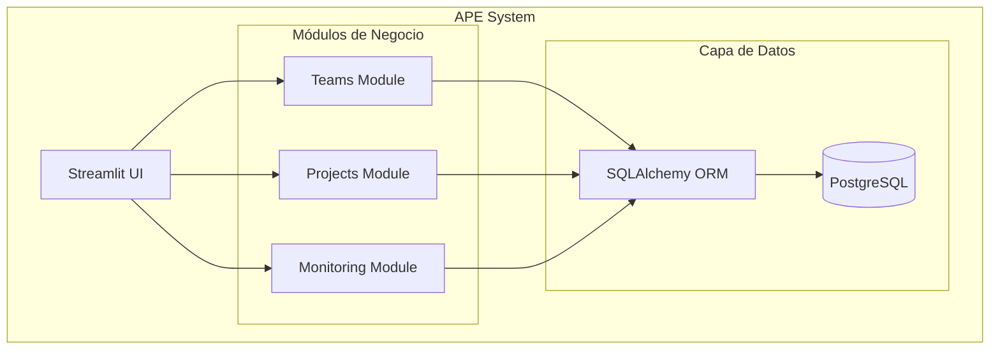
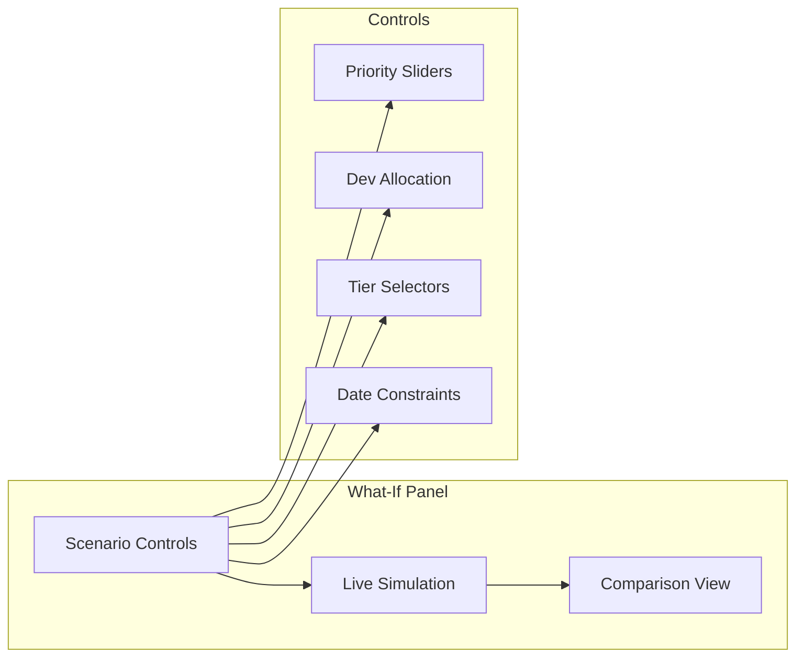
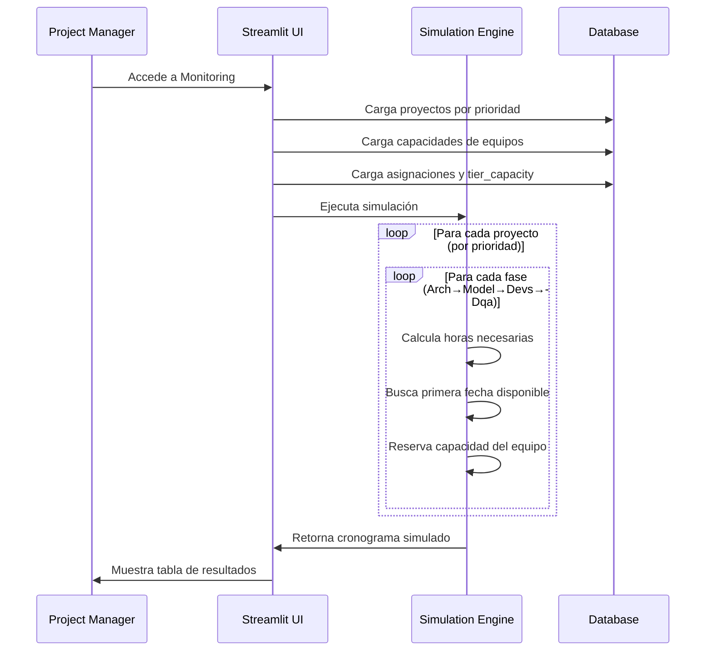

# APE (Automatic Project Estimator) - Arquitectura del Sistema

## Visión General

APE es un sistema de estimación y planificación de proyectos internos de desarrollo de software que permite:
- Gestionar equipos especializados y su capacidad
- Estimar proyectos basándose en tiers de complejidad
- Simular cronogramas de entrega considerando dependencias secuenciales
- Realizar análisis "what-if" para optimizar la planificación

## Stack Tecnológico

- **Frontend**: Streamlit (Python)
- **Backend**: SQLAlchemy + PostgreSQL
- **Containerización**: Docker + Docker Compose
- **Base de Datos**: PostgreSQL 15

## Arquitectura de Componentes



## Conceptos Clave del Dominio

### 1. Equipos Especializados
El sistema maneja 4 equipos especializados que trabajan **secuencialmente**:
- **Arch** (Architecture): Diseño y arquitectura del sistema
- **Model** (Modeling): Modelado de datos y lógica de negocio
- **Devs** (Development): Implementación y desarrollo
- **Dqa** (Data Quality Assurance): Testing y aseguramiento de calidad

### 2. Tiers de Complejidad
Cada proyecto se clasifica por **tier de complejidad** (1-4) que determina las horas base necesarias:
- **Tier 1**: Proyectos simples, pocas horas
- **Tier 2**: Proyectos de complejidad media
- **Tier 3**: Proyectos complejos
- **Tier 4**: Proyectos muy complejos, muchas horas

### 3. Gestión de Capacidad
- **Total Devs**: Capacidad máxima del equipo
- **Busy Devs**: Desarrolladores actualmente ocupados
- **Devs Assigned**: Desarrolladores asignados a un proyecto específico

## Módulo de Forecasting (FOCO PRINCIPAL)

### Algoritmo de Simulación Actual

El módulo de monitoring implementa un algoritmo de simulación que:

1. **Carga proyectos por prioridad** (orden de ejecución)
2. **Simula ejecución secuencial** por cada proyecto: Arch → Model → Devs → Dqa
3. **Calcula fechas de inicio/fin** considerando:
   - Capacidad disponible de cada equipo
   - Dependencias entre fases
   - Días laborables (BusinessDay)
   - Conflictos de recursos

### Fórmulas de Estimación

```python
# Horas necesarias por fase
if estimated_hours > 0:
    hours_needed = estimated_hours  # Override manual
else:
    hours_needed = tier_capacity.hours_per_person * devs_assigned

# Días necesarios
hours_per_day = devs_assigned * 8  # 8 horas por dev por día
days_needed = ceil(hours_needed / hours_per_day)
```

### Algoritmo de Scheduling

```python
def fits(start_date: date) -> bool:
    """Verifica si el equipo tiene capacidad en el período requerido"""
    for day in range(days_needed):
        business_day = start_date + BusinessDay(day)
        used_devs = busy_devs + sum(active_assignments_on_day)
        if used_devs + devs_required > total_devs:
            return False
    return True

# Buscar primera fecha disponible
while not fits(candidate_start):
    candidate_start = next_available_day()
```

## Análisis "What-If" - Área de Mejora

### Variables Manipulables Identificadas

El sistema actual permite modificar estas variables que impactan el forecasting:

#### 1. **Prioridad de Proyectos**
- **Ubicación**: `projects.priority`
- **Impacto**: Determina el orden de ejecución en la simulación
- **UI Actual**: Drag & drop en módulo Projects
- **Mejora Propuesta**: Slider temporal en Monitoring para simular reordenamientos

#### 2. **Cantidad de Desarrolladores Asignados**
- **Ubicación**: `project_team_assignments.devs_assigned`
- **Impacto**: Afecta duración y capacidad requerida
- **UI Actual**: Input numérico en edición de assignments
- **Mejora Propuesta**: Controles dinámicos en vista de forecasting

#### 3. **Tier de Complejidad**
- **Ubicación**: `project_team_assignments.tier`
- **Impacto**: Cambia las horas base necesarias
- **UI Actual**: Dropdown en edición de assignments
- **Mejora Propuesta**: Selector rápido en vista de simulación

#### 4. **Fechas de Inicio**
- **Ubicación**: `project_team_assignments.ready_to_start_date`
- **Impacto**: Restringe cuándo puede comenzar cada fase
- **UI Actual**: Date picker en edición
- **Mejora Propuesta**: Timeline interactivo

### Propuesta de Mejora: Panel "What-If"



### Funcionalidades Propuestas

1. **Escenarios Temporales**: Modificar variables sin persistir cambios
2. **Comparación Side-by-Side**: Baseline vs. escenario modificado
3. **Métricas de Impacto**: 
   - Cambio en fechas de entrega
   - Utilización de equipos
   - Cuellos de botella identificados
4. **Optimización Automática**: Sugerir mejores asignaciones

## Flujo de Trabajo Actual



## Limitaciones Actuales

1. **Simulación Estática**: No permite modificar parámetros en tiempo real
2. **Vista Limitada**: Solo muestra resultado final, no proceso intermedio
3. **Sin Comparación**: No permite evaluar múltiples escenarios
4. **Optimización Manual**: Requiere prueba y error para encontrar mejores asignaciones

## Próximos Pasos Recomendados

1. **Implementar Panel What-If** en el módulo de Monitoring
2. **Agregar Simulación Interactiva** con controles en tiempo real
3. **Desarrollar Vista de Comparación** de escenarios
4. **Implementar Métricas de Optimización** (utilización, cuellos de botella)
5. **Agregar Persistencia de Escenarios** para análisis posteriores

## Matriz de Horas por Tier (Configuración Actual)

| Equipo | Tier 1 | Tier 2 | Tier 3 | Tier 4 |
|--------|--------|--------|--------|--------|
| Arch   | 16h    | 32h    | 72h    | 240h   |
| Devs   | 16h    | 40h    | 80h    | 120h   |
| Model  | 40h    | 80h    | 120h   | 160h   |
| Dqa    | 8h     | 24h    | 40h    | -      |

Esta matriz es configurable a través del módulo Teams y determina las horas base para cada combinación equipo-tier.