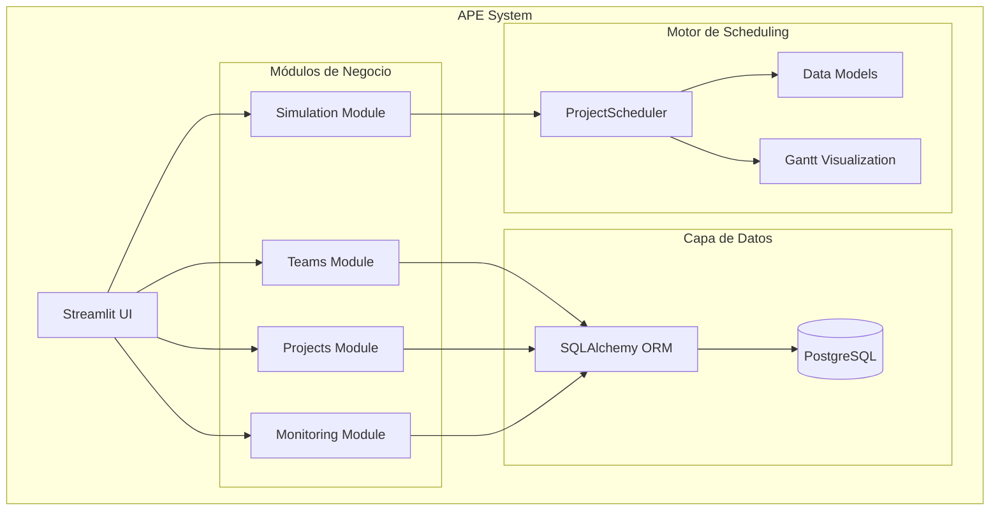
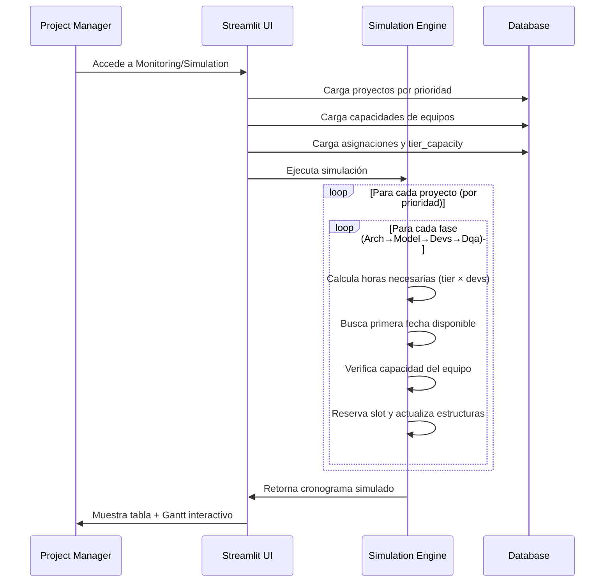

# 🏗️ APE (Automatic Project Estimator) - Arquitectura Consolidada

## 📋 Visión General del Sistema

APE es un sistema de estimación y planificación de proyectos internos de desarrollo de software que permite gestionar equipos especializados, estimar proyectos basándose en tiers de complejidad, y simular cronogramas de entrega considerando dependencias secuenciales.

## 🎯 Conceptos Fundamentales del Dominio

### 1. Equipos Especializados (Sequential Workflow)
El sistema maneja 4 equipos especializados que trabajan **secuencialmente**:
- **Arch** (Architecture): Diseño y arquitectura del sistema
- **Model** (Modeling): Modelado de datos y lógica de negocio  
- **Devs** (Development): Implementación y desarrollo
- **Dqa** (Data Quality Assurance): Testing y aseguramiento de calidad

**Flujo Obligatorio**: Arch → Model → Devs → Dqa

### 2. Sistema de Tiers de Complejidad
Cada proyecto se clasifica por **tier de complejidad** (1-4) que determina las horas base necesarias:

| Equipo | Tier 1 | Tier 2 | Tier 3 | Tier 4 |
|--------|--------|--------|--------|--------|
| Arch   | 16h    | 32h    | 72h    | 240h   |
| Model  | 40h    | 80h    | 120h   | 160h   |
| Devs   | 16h    | 40h    | 80h    | 120h   |
| Dqa    | 8h     | 24h    | 40h    | -      |

### 3. Gestión de Capacidad por Equipo
- **Total Devs**: Capacidad máxima del equipo
- **Busy Devs**: Desarrolladores actualmente ocupados
- **Devs Assigned**: Desarrolladores asignados a un proyecto específico
- **Available Devs**: `total_devs - busy_devs`

## 🏛️ Stack Tecnológico

- **Frontend**: Streamlit (Python)
- **Backend**: SQLAlchemy + PostgreSQL
- **Containerización**: Docker + Docker Compose
- **Base de Datos**: PostgreSQL 15
- **Testing**: pytest + pytest-mock + freezegun
- **Visualización**: Plotly (Gantt Charts)

## 🗄️ Modelo de Datos Detallado

### Esquema de Base de Datos

```mermaid
erDiagram
    projects ||--o{ project_team_assignments : "1:N"
    teams ||--o{ project_team_assignments : "1:N"
    teams ||--o{ tier_capacity : "1:N"
    
    projects {
        int id PK "Identificador único del proyecto"
        text name "Nombre del proyecto"
        int priority "Orden de ejecución (1=más prioritario)"
        text phase "Campo legacy, no usado actualmente"
        date start_date "Fecha de inicio del proyecto"
        date due_date_wo_qa "Fecha límite sin QA"
        date due_date_with_qa "Fecha límite con QA"
    }
    
    teams {
        int id PK "Identificador único del equipo"
        text name UNIQUE "Nombre del equipo (Arch, Devs, Model, Dqa)"
        int total_devs "Capacidad máxima del equipo"
        int busy_devs "Desarrolladores ocupados actualmente"
    }
    
    project_team_assignments {
        int id PK "Identificador único de la asignación"
        int project_id FK "Referencia al proyecto"
        int team_id FK "Referencia al equipo"
        int tier "Nivel de complejidad (1-4)"
        numeric devs_assigned "Desarrolladores asignados (permite decimales)"
        numeric max_devs "Máximo de desarrolladores permitidos"
        int estimated_hours "Horas estimadas (override manual)"
        date start_date "Fecha de inicio de la asignación"
        date ready_to_start_date "Fecha cuando puede comenzar"
        date paused_on "Fecha de pausa (si aplica)"
        int pending_hours "Horas pendientes"
        text status "Estado actual de la asignación"
    }
    
    tier_capacity {
        int id PK "Identificador único"
        int team_id FK "Referencia al equipo"
        int tier "Nivel de complejidad (1-4)"
        int hours_per_person "Horas base por persona para este tier"
    }
```

### Lógica de Cálculo de Horas

```python
# Si hay override manual
IF estimated_hours > 0 THEN
    horas_necesarias = estimated_hours
ELSE
    # Usar matriz de tier_capacity
    horas_necesarias = tier_capacity.hours_per_person * devs_assigned
END IF

# Cálculo de días necesarios
hours_per_day = devs_assigned * 8  # 8 horas por dev por día
days_needed = ceil(horas_necesarias / hours_per_day)
```

## 🧠 Algoritmo de Scheduling (Motor Core)

### Estructuras de Datos en Memoria

```python
# Estado durante la simulación
active_by_team = {
    team_id: [
        {
            'start': date(2025, 6, 16),
            'end': date(2025, 6, 17), 
            'devs': 1.0
        }
    ]
}

project_next_free = {
    project_id: date(2025, 6, 18)  # Cuándo puede continuar la siguiente fase
}
```

### Algoritmo Principal

```python
def simulate_project_schedule():
    # 1. Cargar y ordenar por prioridad y fase
    assignments = load_assignments_ordered_by_priority_and_phase()
    
    # 2. Procesar cada asignación secuencialmente
    for assignment in assignments:
        # 3. Calcular horas necesarias
        hours_needed = calculate_hours(assignment, team)
        days_needed = ceil(hours_needed / (assignment.devs_assigned * 8))
        
        # 4. Determinar fecha de inicio más temprana
        earliest_start = max(
            assignment.ready_to_start_date,
            project_next_free.get(assignment.project_id, today),
            today
        )
        
        # 5. Buscar primer slot disponible
        start_date = find_available_slot(
            team_id=assignment.team_id,
            devs_needed=assignment.devs_assigned,
            days_needed=days_needed,
            earliest_start=earliest_start
        )
        
        # 6. Calcular fecha de fin y actualizar estructuras
        end_date = start_date + BusinessDay(days_needed)
        
        # 7. Registrar asignación activa
        active_by_team[assignment.team_id].append({
            'start': start_date,
            'end': end_date,
            'devs': assignment.devs_assigned
        })
        
        # 8. Actualizar cuándo puede continuar el proyecto
        project_next_free[assignment.project_id] = next_business_day(end_date)
```

### Verificación de Capacidad

```python
def fits_in_period(team_id, devs_needed, days_needed, start_date):
    """Verifica si el equipo tiene capacidad en el período requerido"""
    team = teams[team_id]
    
    for day_offset in range(days_needed):
        check_date = start_date + BusinessDay(day_offset)
        
        # Calcular desarrolladores ocupados en esta fecha
        occupied_devs = team.busy_devs
        for assignment in active_by_team[team_id]:
            if assignment['start'] <= check_date <= assignment['end']:
                occupied_devs += assignment['devs']
        
        # Verificar si hay capacidad suficiente
        if occupied_devs + devs_needed > team.total_devs:
            return False
    
    return True
```

## 🎯 Casos Especiales Implementados

### 1. **Regla del +1 Día**
**Problema**: Si una fase necesita 8 horas y empieza el día X, matemáticamente terminaría el día X también.
**Solución**: Se suma 1 día para reflejar el paso real de esas 8 horas.

```python
# Ejemplo: 8 horas, 1 dev
hours_per_day = 1 * 8 = 8
days_needed = ceil(8 / 8) = 1
# Pero end_date = start_date + BusinessDay(1) = día siguiente
```

### 2. **Paralelismo Automático**
El sistema permite paralelismo cuando hay capacidad disponible:

```
Equipo Arch (capacity=2):
2025-06-16: [Alpha-Arch(1 dev), Beta-Arch(1 dev)] = 2/2 devs ocupados ✅
```

### 3. **Dependencias Secuenciales Estrictas**
Las fases de un mismo proyecto NUNCA se solapan:

```
Alpha: Arch(16-17) → Model(18-24) → Devs(25-31) → Dqa(01-05)
```

### 4. **Manejo de Prioridades**
Proyectos con menor número de prioridad se procesan primero:
- Priority 1 → se programa primero
- Priority 2 → se programa después
- Priority 3 → se programa al final

### 5. **Restricciones de Fecha Ready**
`ready_to_start_date` actúa como constraint mínimo:

```python
earliest_start = max(
    assignment.ready_to_start_date,  # No puede empezar antes
    project_next_free[project_id],   # Dependencia secuencial
    simulation_start_date            # Fecha de simulación
)
```

## 🏗️ Arquitectura de Componentes



## 📊 Módulo de Simulación Avanzada

### Funcionalidades Implementadas
- **Vista Detallada**: Una línea por proyecto-fase
- **Vista Consolidada**: Timeline continuo por proyecto con fases en colores
- **Switch de Vistas**: Toggle entre vistas sin perder datos
- **Análisis What-If**: Experimentación con diferentes escenarios
- **Visualización Interactiva**: Gráficos Gantt con Plotly

### Esquema de Colores por Fase
- **Arch**: `#FF6B6B` (Rojo coral) - Arquitectura
- **Model**: `#45B7D1` (Azul) - Modelado  
- **Devs**: `#4ECDC4` (Turquesa) - Desarrollo
- **Dqa**: `#96CEB4` (Verde) - QA

### Optimizaciones de Rendimiento
1. **Validación temprana de capacidad** antes de buscar slots
2. **Búsqueda inteligente** saltando a fechas libres conocidas
3. **Límite conservador** de 180 días (6 meses) máximo
4. **Cache de datos** por 5 minutos en Streamlit
5. **Control inteligente** de re-renderizado automático

## 🧪 Estrategia de Testing Completa

### Estructura de Tests
```
tests/
├── unit/                    # Tests de modelos y lógica pura
├── integration/             # Tests de CRUDs con mocks
└── simulation/              # Tests de escenarios críticos
```

### Casos Críticos Cubiertos
- **Dependencias Secuenciales**: Arch → Model → Devs → Dqa
- **Manejo de Prioridades**: Priority 1 antes que Priority 2
- **Restricciones de Capacidad**: Paralelismo limitado por recursos
- **Fechas de Restricción**: `ready_to_start_date` constraints
- **Cálculos de Fechas**: Días hábiles correctos (+1 día)
- **Casos Edge**: Teams sin capacidad, proyectos vacíos

## 🔄 Flujo de Trabajo Completo



## 🎯 Variables Manipulables para What-If Analysis

### 1. **Prioridad de Proyectos** (`projects.priority`)
- **Impacto**: Determina el orden de ejecución en la simulación
- **UI**: Drag & drop en módulo Projects + controles en Simulation

### 2. **Cantidad de Desarrolladores Asignados** (`devs_assigned`)
- **Impacto**: Afecta duración y capacidad requerida
- **Fórmula**: `days = ceil(hours_needed / (devs_assigned * 8))`

### 3. **Tier de Complejidad** (`tier`)
- **Impacto**: Cambia las horas base necesarias
- **Fórmula**: `hours_needed = tier_capacity[tier] * devs_assigned`

### 4. **Fechas de Inicio** (`ready_to_start_date`)
- **Impacto**: Restringe cuándo puede comenzar cada fase
- **Constraint**: `start_date >= ready_to_start_date`

### 5. **Capacidad de Equipos** (`total_devs`, `busy_devs`)
- **Impacto**: Determina paralelismo posible
- **Constraint**: `devs_used <= (total_devs - busy_devs)`

## 📈 Métricas y KPIs del Sistema

### Métricas de Utilización
- **Utilización promedio por equipo**: `occupied_devs / total_devs * 100`
- **Identificación de cuellos de botella**: Equipos con >90% utilización
- **Tiempo de inactividad**: Períodos sin asignaciones activas

### Métricas de Proyectos
- **Duración total del proyecto**: Desde primera fase hasta última
- **Delays vs. fechas objetivo**: `calculated_end - due_date`
- **Horas totales por proyecto**: Suma de todas las fases
- **Eficiencia de recursos**: Horas planificadas vs. capacidad disponible

## 🚀 Próximos Pasos y Mejoras Propuestas

### Funcionalidades Avanzadas
1. **Panel What-If Interactivo**: Modificar variables sin persistir cambios
2. **Comparación Side-by-Side**: Baseline vs. escenario modificado
3. **Optimización Automática**: Sugerir mejores asignaciones
4. **Alertas Inteligentes**: Notificar cuellos de botella y conflictos

### Mejoras Técnicas
1. **Cache Inteligente**: Invalidación selectiva de cache
2. **Paralelización**: Simulaciones concurrentes para what-if
3. **Exportación**: PDF/Excel de cronogramas y reportes
4. **API REST**: Endpoints para integración externa

## 🔧 Configuración y Deployment

### Desarrollo Local
```bash
# Clonar repositorio
git clone <repo-url>
cd marblefaraway

# Levantar con Docker
docker compose up --build

# Acceder a la aplicación
http://localhost:8501
```

### Testing
```bash
# Ejecutar todos los tests
python run_tests.py

# Tests específicos
python -m pytest tests/simulation/ -v
```

### Estructura de Archivos Clave
```
app/
├── modules/
│   ├── common/          # Modelos y CRUDs compartidos
│   ├── teams/           # Gestión de equipos
│   ├── projects/        # Gestión de proyectos  
│   ├── simulation/      # Motor de simulación
│   └── monitoring/      # Dashboard y reportes
├── config/              # Configuraciones
└── assets/              # Recursos estáticos
```

---

**Esta arquitectura consolida todos los aspectos técnicos, de negocio y operacionales del sistema APE, proporcionando una base sólida para el desarrollo, mantenimiento y evolución del sistema.**