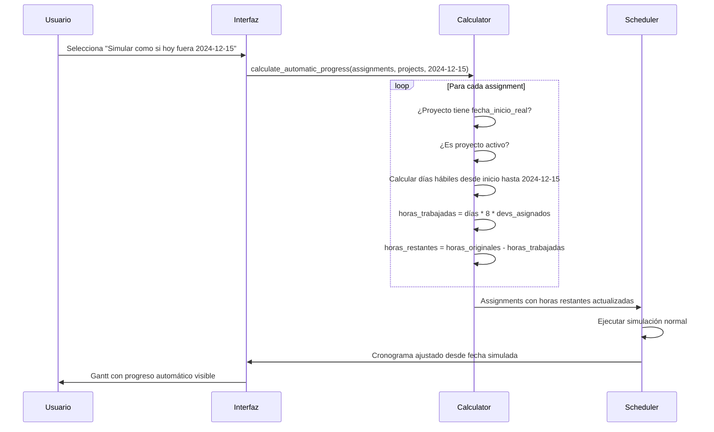

# 🏗️ ARQUITECTURA: Control de "Día de Hoy" en Simulación APE

## 📋 RESUMEN EJECUTIVO

**OBJETIVO**: Agregar control de fecha simulada en la pestaña de simulación para ver el progreso real de proyectos que ya empezaron, calculando automáticamente las horas trabajadas basado en días transcurridos.

**ENFOQUE SIMPLIFICADO**: Modificar la simulación existente para calcular progreso automático basado en `fecha_inicio_real` y días hábiles transcurridos.

## 🎯 LÓGICA DE NEGOCIO

### **Regla Principal:**
```
Para proyectos que YA EMPEZARON (tienen fecha_inicio_real):
horas_trabajadas_calculadas = días_hábiles_transcurridos * 8h * devs_asignados
horas_restantes = horas_estimadas_iniciales - horas_trabajadas_calculadas
```

### **Condiciones:**
- ✅ Solo proyectos con `fecha_inicio_real` definida
- ✅ Solo proyectos activos (`active = true`)
- ✅ Solo assignments que tienen recursos trabajando en el período
- ✅ Considerar días hábiles (lunes a viernes)
- ✅ Usar fecha simulada como "hoy" para los cálculos

## 🏛️ DISEÑO ARQUITECTÓNICO SIMPLIFICADO

### **1. INTERFAZ DE USUARIO**

**Ubicación**: [`app/modules/simulation/simulation.py`](app/modules/simulation/simulation.py) línea ~160

```python
def _render_simulation_config():
    """Renderiza configuración de simulación"""
    col1, col2, col3 = st.columns(3)
    
    with col1:
        sim_start_date = st.date_input(
            "📅 Fecha de inicio de simulación",
            value=date.today(),
            key="real_sim_start"
        )
    
    with col2:
        # NUEVO: Control de fecha simulada
        simulated_today = st.date_input(
            "📅 Simular como si hoy fuera",
            value=date.today(),
            max_value=date.today(),  # No permitir fechas futuras
            key="simulated_today",
            help="Calcula progreso automático hasta esta fecha para proyectos iniciados"
        )
    
    with col3:
        auto_run = st.checkbox("🔄 Ejecutar automáticamente", value=True)
    
    return sim_start_date, simulated_today, auto_run
```

### **2. CALCULADOR DE PROGRESO AUTOMÁTICO**

**Nueva función en**: [`app/modules/simulation/scheduler.py`](app/modules/simulation/scheduler.py)

```python
def calculate_automatic_progress(assignments: List[Assignment], 
                               projects: Dict[int, Project], 
                               simulated_today: date) -> None:
    """
    Calcula progreso automático para assignments de proyectos que ya empezaron
    
    Args:
        assignments: Lista de assignments a procesar
        projects: Diccionario de proyectos
        simulated_today: Fecha simulada como "hoy"
    """
    for assignment in assignments:
        project = projects.get(assignment.project_id)
        
        # Solo procesar proyectos activos que ya empezaron
        if not project or not project.active or not project.fecha_inicio_real:
            continue
            
        # Solo si la fecha simulada es posterior al inicio real
        if simulated_today <= project.fecha_inicio_real:
            continue
            
        # Calcular días hábiles transcurridos
        business_days = calculate_business_days(project.fecha_inicio_real, simulated_today)
        
        # Calcular horas trabajadas automáticamente
        hours_worked = business_days * 8 * assignment.devs_assigned
        
        # Actualizar horas restantes (no puede ser negativo)
        original_hours = assignment.estimated_hours
        assignment.estimated_hours = max(0, original_hours - hours_worked)
        
        # Guardar información para mostrar en UI
        assignment.auto_calculated_hours = hours_worked
        assignment.original_estimated_hours = original_hours

def calculate_business_days(start_date: date, end_date: date) -> int:
    """Calcula días hábiles entre dos fechas usando pandas"""
    try:
        business_days = pd.bdate_range(start_date, end_date).shape[0] - 1  # Excluir el día final
        return max(0, business_days)
    except Exception as e:
        logger.error(f"Error calculando días hábiles: {e}")
        return 0
```

### **3. INTEGRACIÓN CON SIMULACIÓN EXISTENTE**

**Modificar**: [`app/modules/simulation/simulation.py`](app/modules/simulation/simulation.py) función `_execute_simulation`

```python
def _execute_simulation(initial_data, priority_overrides, sim_start_date, simulated_today):
    """Ejecuta la simulación con los parámetros dados"""
    try:
        # Preparar datos de simulación
        simulation_input = load_simulation_input_from_db(sim_start_date)
        
        # NUEVO: Aplicar cálculo de progreso automático
        if simulated_today != date.today():
            calculate_automatic_progress(
                simulation_input.assignments, 
                simulation_input.projects, 
                simulated_today
            )
        
        # Aplicar overrides de prioridad (existente)
        _apply_priority_overrides(simulation_input, priority_overrides)
        
        # Ejecutar simulación normal
        with st.spinner("Ejecutando simulación..."):
            scheduler = ProjectScheduler()
            result = scheduler.simulate(simulation_input)
        
        # Guardar resultados incluyendo fecha simulada
        st.session_state.simulation_result = result
        st.session_state.simulation_input_data = simulation_input
        st.session_state.simulated_today = simulated_today
        
        st.success(f"✅ Simulación completada (simulando hasta {simulated_today})")
        
    except Exception as e:
        st.error(f"❌ Error ejecutando simulación: {str(e)}")
```

### **4. VISUALIZACIÓN EN GANTT**

**Modificar**: [`app/modules/simulation/gantt_views.py`](app/modules/simulation/gantt_views.py)

```python
def add_progress_indicators(gantt_df: pd.DataFrame, simulated_today: date) -> pd.DataFrame:
    """Agrega indicadores de progreso automático al DataFrame del Gantt"""
    
    # Agregar columna de progreso calculado
    gantt_df['AutoProgress'] = gantt_df.apply(
        lambda row: calculate_progress_percentage(row, simulated_today), 
        axis=1
    )
    
    # Modificar nombres de tareas para mostrar progreso
    gantt_df['Task'] = gantt_df.apply(
        lambda row: f"{row['Task']} ({row['AutoProgress']:.0f}% auto)" 
        if row['AutoProgress'] > 0 else row['Task'], 
        axis=1
    )
    
    return gantt_df

def calculate_progress_percentage(row, simulated_today: date) -> float:
    """Calcula porcentaje de progreso automático para una fila del Gantt"""
    # Lógica para calcular progreso basado en días transcurridos
    # Retorna 0-100
    pass
```

### **5. MÉTRICAS ACTUALIZADAS**

**Agregar en**: [`app/modules/simulation/simulation.py`](app/modules/simulation/simulation.py) función `_render_metrics`

```python
def _render_metrics(simulation_input, result, priority_overrides, simulated_today):
    """Renderiza métricas generales de la simulación"""
    col1, col2, col3, col4, col5 = st.columns(5)
    
    # Métricas existentes
    with col1:
        st.metric("📋 Proyectos", len(simulation_input.projects))
    with col2:
        st.metric("👥 Equipos", len(simulation_input.teams))
    with col3:
        st.metric("🎯 Asignaciones", len(result.assignments))
    with col4:
        changes = len(priority_overrides)
        st.metric("🔄 Cambios de Prioridad", changes)
    
    # NUEVA: Métrica de progreso automático
    with col5:
        if simulated_today != date.today():
            auto_progress_count = count_assignments_with_auto_progress(result.assignments)
            st.metric("⚡ Progreso Auto", auto_progress_count, 
                     help=f"Assignments con progreso calculado hasta {simulated_today}")
        else:
            st.metric("📅 Fecha Simulada", "Hoy")
```

## 🔧 IMPLEMENTACIÓN PASO A PASO

### **FASE 1: Control de Fecha (1 día)**
1. Agregar selector de fecha simulada en `_render_simulation_config()`
2. Validar que no sea fecha futura
3. Pasar parámetro a `_execute_simulation()`

### **FASE 2: Cálculo de Progreso (2 días)**
1. Implementar `calculate_automatic_progress()` en scheduler
2. Implementar `calculate_business_days()` usando pandas
3. Modificar assignments con horas restantes calculadas

### **FASE 3: Integración (1 día)**
1. Conectar cálculo con simulación existente
2. Actualizar métricas para mostrar progreso automático
3. Testing básico con datos reales

### **FASE 4: Visualización (1 día)**
1. Agregar indicadores de progreso en Gantt
2. Mostrar información de horas trabajadas vs restantes
3. Tooltips explicativos

## 📊 EJEMPLO DE FUNCIONAMIENTO



## 🎯 CASOS DE USO

### **Caso 1: Proyecto Recién Iniciado**
- **Proyecto**: "Sistema CRM" 
- **fecha_inicio_real**: 2024-12-01
- **Fecha simulada**: 2024-12-10 (7 días hábiles después)
- **Assignment Arch**: 80h estimadas, 2 devs
- **Resultado**: 7 * 8 * 2 = 112h trabajadas → 0h restantes (fase completada)

### **Caso 2: Proyecto en Progreso**
- **Proyecto**: "App Mobile"
- **fecha_inicio_real**: 2024-12-05  
- **Fecha simulada**: 2024-12-10 (3 días hábiles después)
- **Assignment Devs**: 200h estimadas, 3 devs
- **Resultado**: 3 * 8 * 3 = 72h trabajadas → 128h restantes

### **Caso 3: Proyecto No Iniciado**
- **Proyecto**: "Dashboard Analytics"
- **fecha_inicio_real**: null
- **Resultado**: Sin cambios, simulación normal desde fecha simulada

## ✅ BENEFICIOS DE ESTA ARQUITECTURA

1. **Simplicidad**: Reutiliza toda la lógica existente del scheduler
2. **Precisión**: Cálculo automático basado en días hábiles reales
3. **Flexibilidad**: Funciona con cualquier fecha pasada
4. **Compatibilidad**: No rompe funcionalidad existente
5. **Performance**: Cálculos simples, sin complejidad adicional

## 🚀 RESULTADO ESPERADO

Al implementar esta arquitectura, el usuario podrá:

- **Seleccionar cualquier fecha pasada** como "día simulado"
- **Ver automáticamente** cuántas horas se han trabajado en proyectos iniciados
- **Visualizar en el Gantt** el progreso real vs planificado
- **Entender el impacto** de retrasos o adelantos en el cronograma
- **Tomar decisiones** basadas en el estado real de los proyectos

La simulación mostrará exactamente cómo se verían los proyectos "si hoy fuera esa fecha", con progreso automático calculado para todos los proyectos que ya empezaron.