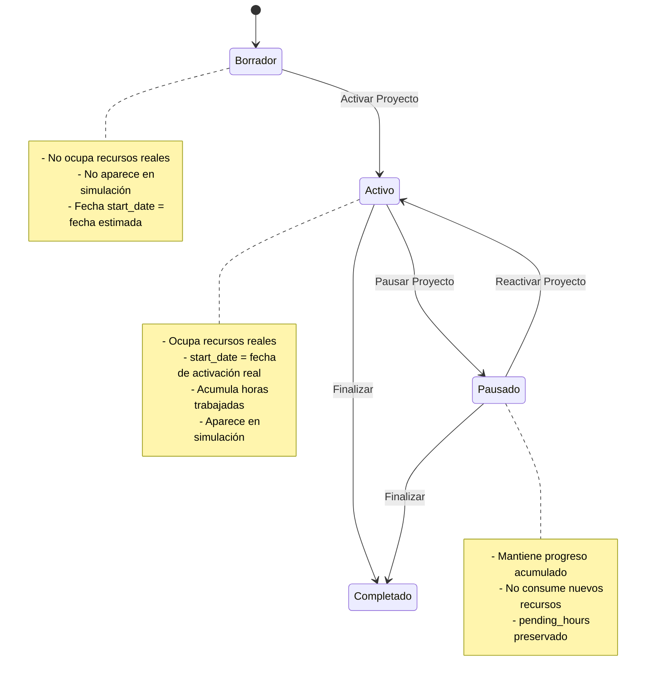
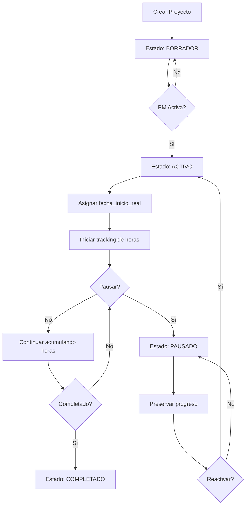

# 🏗️ ARQUITECTURA: SISTEMA DE ESTADOS DE PROYECTOS APE

## 📋 ANÁLISIS DEL SISTEMA ACTUAL

### **Modelo de Datos Existente**
- **Projects**: `id`, `name`, `priority`, `phase`, `start_date`, `due_date_wo_qa`, `due_date_with_qa`
- **Assignments**: `id`, `project_id`, `team_id`, `tier`, `devs_assigned`, `max_devs`, `estimated_hours`, `start_date`, `ready_to_start_date`, `paused_on`, `pending_hours`, `status`
- **Teams**: `id`, `name`, `total_devs`, `busy_devs`

### **Campos Existentes Reutilizables**
1. **`projects.phase`**: Campo TEXT existente pero no utilizado - **PERFECTO para estado del proyecto**
2. **`assignments.status`**: Ya existe para tracking de estado por assignment
3. **`assignments.paused_on`**: Ya existe para manejar pausas
4. **`assignments.pending_hours`**: Ya existe para tracking de progreso
5. **`projects.start_date`**: Puede ser la fecha de activación real

### **Flujo Actual Identificado**
- Los proyectos se crean como borradores y requieren activación manual
- El tracking ya existe a nivel de assignment (no proyecto completo) ✅
- La simulación ya maneja estados y fechas calculadas
- El sistema ya soporta pausas a nivel de assignment

---

## 🏗️ ARQUITECTURA PROPUESTA: SISTEMA DE ESTADOS DE PROYECTOS APE

### **1. Estados de Proyecto (Reutilizando `projects.phase`)**



### **2. Modelo de Datos - Cambios Mínimos**

#### **Tabla `projects` (SIN cambios de esquema)**
```sql
-- Reutilizar campo existente 'phase' para estados
-- Valores: 'draft', 'active', 'paused', 'completed'
-- start_date: fecha estimada (draft) o fecha real de activación (active)
```

#### **Tabla `project_team_assignments` (SIN cambios de esquema)**
```sql
-- Campos existentes reutilizados:
-- status: 'Not Started', 'In Progress', 'Paused', 'Completed'
-- paused_on: fecha de pausa (ya existe)
-- pending_hours: horas restantes (ya existe)
-- start_date: fecha de inicio de assignment
```

#### **Nuevos campos calculados (solo en modelos Python)**
```python
@dataclass
class Project:
    # ... campos existentes ...
    
    # Campos calculados (NO van a DB)
    actual_start_date: Optional[date] = None  # Fecha real de activación
    total_hours_worked: int = 0  # Suma de horas trabajadas
    total_hours_remaining: int = 0  # Suma de pending_hours
    
    def is_draft(self) -> bool:
        return self.phase == 'draft'
    
    def is_active(self) -> bool:
        return self.phase == 'active'
    
    def is_paused(self) -> bool:
        return self.phase == 'paused'
    
    def get_state_display(self) -> str:
        """Retorna estado legible para UI"""
        state_map = {
            'draft': '📝 Borrador',
            'active': '🟢 Activo',
            'paused': '⏸️ Pausado',
            'completed': '✅ Completado'
        }
        return state_map.get(self.phase, '❓ Desconocido')
    
    def get_state_color(self) -> str:
        """Retorna color para UI según estado"""
        color_map = {
            'draft': '#6c757d',      # Gris
            'active': '#28a745',     # Verde
            'paused': '#ffc107',     # Amarillo
            'completed': '#007bff'   # Azul
        }
        return color_map.get(self.phase, '#6c757d')
```

### **3. Transiciones de Estado en UI**

#### **3.1 Componente de Estado del Proyecto**

```python
def render_project_state_controls(project: Project, assignments: List[Assignment]) -> bool:
    """
    Renderiza controles de estado del proyecto
    Retorna True si hubo cambios de estado
    """
    st.subheader(f"🎯 Estado del Proyecto: {project.get_state_display()}")
    
    # Mostrar información del estado actual
    col1, col2, col3 = st.columns(3)
    
    with col1:
        st.metric(
            label="Estado Actual",
            value=project.get_state_display(),
            delta=None
        )
    
    with col2:
        if project.is_active():
            days_active = (date.today() - project.start_date).days
            st.metric(
                label="Días Activo",
                value=f"{days_active} días",
                delta=None
            )
        elif project.is_draft():
            st.metric(
                label="Fecha Estimada",
                value=project.start_date.strftime("%d/%m/%Y"),
                delta=None
            )
    
    with col3:
        progress = calculate_project_progress(project.id, assignments)
        st.metric(
            label="Progreso",
            value=f"{progress['progress_percentage']:.1f}%",
            delta=None
        )
    
    # Controles de transición de estado
    return render_state_transition_buttons(project, assignments)

def render_state_transition_buttons(project: Project, assignments: List[Assignment]) -> bool:
    """Renderiza botones de transición según estado actual"""
    state_changed = False
    
    st.markdown("### 🔄 Acciones Disponibles")
    
    if project.is_draft():
        # BORRADOR → ACTIVO
        col1, col2 = st.columns(2)
        
        with col1:
            if st.button("🚀 Activar Proyecto", type="primary", key=f"activate_{project.id}"):
                if confirm_project_activation(project, assignments):
                    activate_project(project)
                    st.success(f"✅ Proyecto '{project.name}' activado exitosamente!")
                    state_changed = True
        
        with col2:
            st.info("💡 Al activar el proyecto comenzará a consumir recursos reales")
    
    elif project.is_active():
        # ACTIVO → PAUSADO o COMPLETADO
        col1, col2, col3 = st.columns(3)
        
        with col1:
            if st.button("⏸️ Pausar Proyecto", key=f"pause_{project.id}"):
                if confirm_project_pause(project, assignments):
                    pause_project(project, assignments)
                    st.warning(f"⏸️ Proyecto '{project.name}' pausado")
                    state_changed = True
        
        with col2:
            progress = calculate_project_progress(project.id, assignments)
            if progress['progress_percentage'] >= 100:
                if st.button("✅ Marcar Completado", type="primary", key=f"complete_{project.id}"):
                    complete_project(project, assignments)
                    st.success(f"🎉 Proyecto '{project.name}' completado!")
                    state_changed = True
            else:
                st.button("✅ Marcar Completado", disabled=True, key=f"complete_disabled_{project.id}")
                st.caption("⚠️ Proyecto debe estar 100% completo")
        
        with col3:
            st.metric(
                label="Horas Trabajadas Hoy",
                value=f"{calculate_daily_hours(project.id, assignments)} hrs",
                delta=None
            )
    
    elif project.is_paused():
        # PAUSADO → ACTIVO o COMPLETADO
        col1, col2 = st.columns(2)
        
        with col1:
            if st.button("▶️ Reactivar Proyecto", type="primary", key=f"resume_{project.id}"):
                if confirm_project_reactivation(project, assignments):
                    reactivate_project(project, assignments)
                    st.success(f"▶️ Proyecto '{project.name}' reactivado!")
                    state_changed = True
        
        with col2:
            if st.button("✅ Marcar Completado", key=f"complete_paused_{project.id}"):
                complete_project(project, assignments)
                st.success(f"🎉 Proyecto '{project.name}' completado!")
                state_changed = True
        
        # Mostrar información de pausa
        paused_assignments = [a for a in assignments if a.paused_on is not None]
        if paused_assignments:
            st.info(f"📊 {len(paused_assignments)} asignaciones pausadas manteniendo progreso")
    
    return state_changed
```

#### **3.2 Diálogos de Confirmación**

```python
def confirm_project_activation(project: Project, assignments: List[Assignment]) -> bool:
    """Diálogo de confirmación para activar proyecto"""
    
    # Calcular impacto de recursos
    total_devs_needed = sum(a.devs_assigned for a in assignments)
    teams_affected = set(a.team_name for a in assignments)
    
    st.markdown("### ⚠️ Confirmar Activación de Proyecto")
    st.markdown(f"**Proyecto:** {project.name}")
    st.markdown(f"**Recursos necesarios:** {total_devs_needed} desarrolladores")
    st.markdown(f"**Equipos afectados:** {', '.join(teams_affected)}")
    
    # Verificar disponibilidad de recursos
    resource_warnings = check_resource_availability(assignments)
    if resource_warnings:
        st.warning("⚠️ **Advertencias de recursos:**")
        for warning in resource_warnings:
            st.markdown(f"- {warning}")
    
    # Fecha de activación
    activation_date = st.date_input(
        "📅 Fecha de activación",
        value=date.today(),
        key=f"activation_date_{project.id}"
    )
    
    col1, col2 = st.columns(2)
    with col1:
        confirm = st.button("✅ Confirmar Activación", type="primary", key=f"confirm_activate_{project.id}")
    with col2:
        cancel = st.button("❌ Cancelar", key=f"cancel_activate_{project.id}")
    
    if confirm:
        project.start_date = activation_date
        return True
    elif cancel:
        st.rerun()
    
    return False

def confirm_project_pause(project: Project, assignments: List[Assignment]) -> bool:
    """Diálogo de confirmación para pausar proyecto"""
    
    st.markdown("### ⏸️ Confirmar Pausa de Proyecto")
    st.markdown(f"**Proyecto:** {project.name}")
    
    # Mostrar progreso actual
    progress = calculate_project_progress(project.id, assignments)
    st.progress(progress['progress_percentage'] / 100)
    st.markdown(f"**Progreso actual:** {progress['progress_percentage']:.1f}%")
    st.markdown(f"**Horas trabajadas:** {progress['worked_hours']} de {progress['total_hours']}")
    
    # Razón de pausa
    pause_reason = st.selectbox(
        "🤔 Razón de la pausa",
        [
            "Esperando recursos externos",
            "Cambio de prioridades",
            "Problemas técnicos",
            "Revisión de requerimientos",
            "Otro"
        ],
        key=f"pause_reason_{project.id}"
    )
    
    if pause_reason == "Otro":
        custom_reason = st.text_input("Especificar razón:", key=f"custom_reason_{project.id}")
    
    st.info("💡 **El progreso se mantendrá:** Todas las horas trabajadas se preservarán para cuando se reactive el proyecto")
    
    col1, col2 = st.columns(2)
    with col1:
        confirm = st.button("⏸️ Confirmar Pausa", type="primary", key=f"confirm_pause_{project.id}")
    with col2:
        cancel = st.button("❌ Cancelar", key=f"cancel_pause_{project.id}")
    
    return confirm and not cancel
```

#### **3.3 Dashboard de Estados de Proyectos**

```python
def render_projects_dashboard():
    """Dashboard principal con vista de todos los proyectos y sus estados"""
    
    st.header("📊 Dashboard de Proyectos APE")
    
    # Cargar datos
    projects = read_all_projects()
    all_assignments = read_all_assignments()
    
    # Métricas generales
    render_project_metrics_summary(projects, all_assignments)
    
    # Filtros
    col1, col2, col3 = st.columns(3)
    
    with col1:
        state_filter = st.selectbox(
            "🔍 Filtrar por estado",
            ["Todos", "📝 Borrador", "🟢 Activo", "⏸️ Pausado", "✅ Completado"],
            key="state_filter"
        )
    
    with col2:
        team_filter = st.selectbox(
            "👥 Filtrar por equipo",
            ["Todos"] + list(set(a.team_name for a in all_assignments)),
            key="team_filter"
        )
    
    with col3:
        sort_by = st.selectbox(
            "📈 Ordenar por",
            ["Prioridad", "Estado", "Progreso", "Fecha de inicio"],
            key="sort_by"
        )
    
    # Lista de proyectos con controles de estado
    filtered_projects = filter_projects(projects, state_filter, team_filter)
    sorted_projects = sort_projects(filtered_projects, sort_by)
    
    for project in sorted_projects:
        project_assignments = [a for a in all_assignments if a.project_id == project.id]
        render_project_card_with_state_controls(project, project_assignments)

def render_project_card_with_state_controls(project: Project, assignments: List[Assignment]):
    """Tarjeta de proyecto con controles de estado integrados"""
    
    with st.container():
        # Header con estado
        col1, col2, col3, col4 = st.columns([3, 1, 1, 1])
        
        with col1:
            st.markdown(f"### {project.name}")
            st.markdown(f"**Prioridad:** {project.priority}")
        
        with col2:
            # Badge de estado con color
            state_color = project.get_state_color()
            st.markdown(
                f'<span style="background-color: {state_color}; color: white; padding: 4px 8px; border-radius: 4px; font-size: 12px;">'
                f'{project.get_state_display()}'
                f'</span>',
                unsafe_allow_html=True
            )
        
        with col3:
            progress = calculate_project_progress(project.id, assignments)
            st.metric("Progreso", f"{progress['progress_percentage']:.0f}%")
        
        with col4:
            # Botón de acción rápida según estado
            if project.is_draft():
                if st.button("🚀 Activar", key=f"quick_activate_{project.id}", type="primary"):
                    st.session_state[f"show_activation_dialog_{project.id}"] = True
            elif project.is_active():
                if st.button("⏸️ Pausar", key=f"quick_pause_{project.id}"):
                    st.session_state[f"show_pause_dialog_{project.id}"] = True
            elif project.is_paused():
                if st.button("▶️ Reactivar", key=f"quick_resume_{project.id}", type="primary"):
                    reactivate_project(project, assignments)
                    st.rerun()
        
        # Barra de progreso
        if not project.is_draft():
            progress = calculate_project_progress(project.id, assignments)
            st.progress(progress['progress_percentage'] / 100)
        
        # Detalles expandibles
        with st.expander(f"📋 Detalles de {project.name}"):
            render_project_details_with_assignments(project, assignments)
        
        # Diálogos modales (si están activos)
        if st.session_state.get(f"show_activation_dialog_{project.id}", False):
            if confirm_project_activation(project, assignments):
                activate_project(project)
                st.session_state[f"show_activation_dialog_{project.id}"] = False
                st.rerun()
        
        if st.session_state.get(f"show_pause_dialog_{project.id}", False):
            if confirm_project_pause(project, assignments):
                pause_project(project, assignments)
                st.session_state[f"show_pause_dialog_{project.id}"] = False
                st.rerun()
        
        st.divider()
```

#### **3.4 Indicadores Visuales en Gantt**

```python
def enhance_gantt_with_project_states(gantt_data: pd.DataFrame, projects: Dict[int, Project]) -> pd.DataFrame:
    """Mejora el Gantt con indicadores visuales de estado"""
    
    # Agregar columna de estado
    gantt_data['project_state'] = gantt_data['project_id'].map(
        lambda pid: projects[pid].phase if pid in projects else 'unknown'
    )
    
    # Agregar colores según estado
    state_colors = {
        'draft': '#6c757d',      # Gris - no se muestra en Gantt
        'active': '#28a745',     # Verde
        'paused': '#ffc107',     # Amarillo
        'completed': '#007bff'   # Azul
    }
    
    gantt_data['color'] = gantt_data['project_state'].map(state_colors)
    
    # Filtrar proyectos borrador del Gantt
    gantt_data = gantt_data[gantt_data['project_state'] != 'draft']
    
    # Agregar patrones para proyectos pausados
    gantt_data['pattern'] = gantt_data['project_state'].map({
        'active': '',
        'paused': 'diagonal-stripes',
        'completed': 'solid'
    })
    
    return gantt_data

def render_gantt_with_state_legend():
    """Renderiza Gantt con leyenda de estados"""
    
    # Leyenda de estados
    st.markdown("### 📊 Cronograma de Proyectos")
    
    col1, col2, col3, col4 = st.columns(4)
    with col1:
        st.markdown("🟢 **Activo** - En progreso")
    with col2:
        st.markdown("🟡 **Pausado** - Progreso preservado")
    with col3:
        st.markdown("🔵 **Completado** - Finalizado")
    with col4:
        st.markdown("⚪ **Borrador** - No se muestra")
    
    # Renderizar Gantt mejorado
    # ... código del Gantt existente con mejoras de estado
```

### **4. Flujo de Estados y Transiciones**



### **5. Lógica de Tracking de Progreso**

#### **Por Assignment (Granular)**
```python
class AssignmentProgressTracker:
    def calculate_progress(self, assignment: Assignment, team: Team) -> dict:
        """Calcula progreso de una asignación específica"""
        total_hours = assignment.get_hours_needed(team)
        worked_hours = total_hours - assignment.pending_hours
        
        return {
            'total_hours': total_hours,
            'worked_hours': worked_hours,
            'pending_hours': assignment.pending_hours,
            'progress_percentage': (worked_hours / total_hours) * 100 if total_hours > 0 else 0
        }
    
    def pause_assignment(self, assignment: Assignment, pause_date: date):
        """Pausa una asignación preservando progreso"""
        assignment.paused_on = pause_date
        assignment.status = 'Paused'
        # pending_hours se mantiene igual
    
    def resume_assignment(self, assignment: Assignment):
        """Reanuda una asignación desde donde se pausó"""
        assignment.paused_on = None
        assignment.status = 'In Progress'
        # pending_hours se mantiene - continúa desde donde se pausó
```

#### **Por Proyecto (Agregado)**
```python
class ProjectProgressTracker:
    def calculate_project_progress(self, project_id: int, assignments: List[Assignment], teams: Dict[int, Team]) -> dict:
        """Calcula progreso agregado del proyecto"""
        project_assignments = [a for a in assignments if a.project_id == project_id]
        
        total_hours = sum(a.get_hours_needed(teams[a.team_id]) for a in project_assignments)
        pending_hours = sum(a.pending_hours for a in project_assignments)
        worked_hours = total_hours - pending_hours
        
        return {
            'total_hours': total_hours,
            'worked_hours': worked_hours,
            'pending_hours': pending_hours,
            'progress_percentage': (worked_hours / total_hours) * 100 if total_hours > 0 else 0,
            'assignments_progress': [
                self.assignment_tracker.calculate_progress(a, teams[a.team_id]) 
                for a in project_assignments
            ]
        }
```

### **6. Impacto en Simulación**

#### **Filtrado por Estado**
```python
class ProjectScheduler:
    def simulate(self, simulation_input: SimulationInput) -> ScheduleResult:
        # Filtrar solo proyectos activos para simulación
        active_projects = {
            pid: p for pid, p in simulation_input.projects.items() 
            if p.phase == 'active'
        }
        
        # Filtrar assignments de proyectos activos
        active_assignments = [
            a for a in simulation_input.assignments 
            if a.project_id in active_projects
        ]
        
        # Continuar con lógica existente...
```

#### **Manejo de Proyectos Pausados**
```python
def handle_paused_projects(self, assignments: List[Assignment]) -> List[Assignment]:
    """Maneja assignments de proyectos pausados"""
    for assignment in assignments:
        if assignment.project.phase == 'paused':
            # No programar nuevas tareas, pero mantener progreso
            assignment.calculated_start_date = None
            assignment.calculated_end_date = None
            # pending_hours se mantiene para cuando se reactive
    
    return assignments
```

### **7. Implementación por Fases**

#### **Fase 1: Infraestructura Base (1-2 días)**
- [ ] Actualizar modelo `Project` con métodos de estado
- [ ] Crear `ProjectStateManager` para transiciones
- [ ] Actualizar CRUDs para manejar campo `phase`
- [ ] Tests unitarios para estados

#### **Fase 2: Lógica de Negocio (2-3 días)**
- [ ] Implementar `ProjectProgressTracker`
- [ ] Implementar `AssignmentProgressTracker`
- [ ] Actualizar simulación para filtrar por estado
- [ ] Tests de integración

#### **Fase 3: UI y Controles (2-3 días)**
- [ ] Agregar controles de estado en `projects.py`
- [ ] Dashboard de progreso por proyecto
- [ ] Indicadores visuales de estado en Gantt
- [ ] Diálogos de confirmación
- [ ] Tests de UI

#### **Fase 4: Validación y Refinamiento (1-2 días)**
- [ ] Tests con datos reales
- [ ] Optimización de performance
- [ ] Documentación
- [ ] Deployment

### **8. Ejemplo de Uso Completo**

```python
# Crear proyecto en borrador
project = Project(
    name="Nuevo Feature X",
    priority=1,
    phase="draft",  # Estado inicial
    start_date=date(2025, 2, 1)  # Fecha estimada
)

# UI muestra: 📝 Borrador con botón "🚀 Activar"
# Usuario hace clic en activar

# Activar proyecto
state_manager = ProjectStateManager()
state_manager.activate_project(project, actual_start_date=date.today())
# project.phase = 'active'
# project.start_date = date.today()  # Fecha real

# UI muestra: 🟢 Activo con botones "⏸️ Pausar" y "✅ Completar"

# Simular progreso
for assignment in project_assignments:
    # Después de 1 día de trabajo en assignment de 8 horas
    assignment.pending_hours = 7  # Quedan 7 horas
    
# UI muestra progreso: 12.5% completado (1 de 8 horas)

# Pausar proyecto
state_manager.pause_project(project)
# project.phase = 'paused'
# Todos los assignments mantienen pending_hours

# UI muestra: ⏸️ Pausado con botón "▶️ Reactivar"

# Reactivar proyecto
state_manager.reactivate_project(project)
# project.phase = 'active'
# Assignments continúan con pending_hours = 7

# UI muestra: 🟢 Activo, progreso sigue en 12.5%
```

---

## 🎯 VENTAJAS DE ESTA ARQUITECTURA

1. **Cambios Mínimos**: Reutiliza campos existentes (`phase`, `paused_on`, `pending_hours`)
2. **No Rompe Funcionalidad**: Simulación y Gantt siguen funcionando
3. **Granularidad Correcta**: Tracking por assignment, no por proyecto completo
4. **UI Intuitiva**: Controles claros y confirmaciones apropiadas
5. **Implementación Simple**: Estados claros y transiciones bien definidas
6. **Escalable**: Fácil agregar nuevos estados en el futuro
7. **Robusta**: Manejo de errores y validaciones integradas
8. **UX Mejorada**: Indicadores visuales y feedback inmediato

---

## 📝 NOTAS DE IMPLEMENTACIÓN

### **Consideraciones Técnicas**
- Usar transacciones de DB para cambios de estado atómicos
- Implementar logging de cambios de estado para auditoría
- Validar permisos de usuario para transiciones de estado
- Manejar casos edge (proyectos sin assignments, etc.)

### **Consideraciones de UX**
- Confirmaciones claras antes de cambios irreversibles
- Feedback visual inmediato en cambios de estado
- Información contextual sobre impacto de cada acción
- Undo/Redo para acciones críticas

### **Performance**
- Cache de cálculos de progreso para proyectos grandes
- Lazy loading de assignments en dashboard
- Optimización de queries para filtros de estado