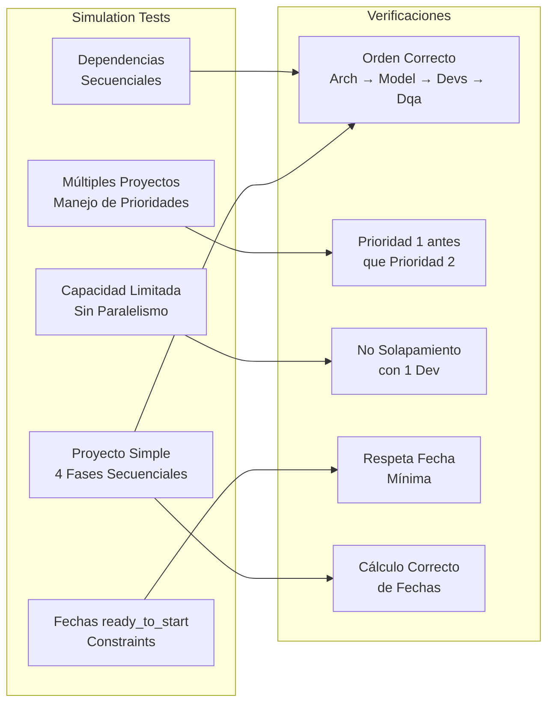

# 🧪 Estrategia Completa de Testing para Sistema APE Unificado

## 📋 Análisis del Sistema

Basándome en el código revisado, el sistema APE tiene estos componentes críticos:

### **Modelos Core** ([`app/modules/common/models.py`](app/modules/common/models.py))
- [`Team`](app/modules/common/models.py:12-30): Gestión de capacidad y tier_capacities
- [`Project`](app/modules/common/models.py:34-42): Estructura básica de proyectos
- [`Assignment`](app/modules/common/models.py:44-76): Lógica compleja de asignaciones
- [`ScheduleResult`](app/modules/common/models.py:79-111): Resultados de simulación
- [`SimulationInput`](app/modules/common/models.py:114-124): Input para simulaciones

### **Motor de Simulación** ([`app/modules/simulation/scheduler.py`](app/modules/simulation/scheduler.py))
- [`ProjectScheduler.simulate()`](app/modules/simulation/scheduler.py:20-53): Algoritmo principal
- [`_process_assignment()`](app/modules/simulation/scheduler.py:55-99): Procesamiento individual
- [`_find_available_slot()`](app/modules/simulation/scheduler.py:101-122): Búsqueda de slots
- [`_fits_in_period()`](app/modules/simulation/scheduler.py:124-145): Verificación de capacidad

### **CRUDs** (Operaciones de DB)
- [`teams_crud.py`](app/modules/common/teams_crud.py): CRUD completo para equipos
- [`projects_crud.py`](app/modules/common/projects_crud.py): CRUD completo para proyectos  
- [`assignments_crud.py`](app/modules/common/assignments_crud.py): CRUD complejo con JOINs

## 🎯 Estrategia de Testing Pragmática

### **1. Unit Tests Básicos** 
Testear lógica de negocio sin dependencias externas

### **2. Integration Tests Robustos**
CRUDs con mocks de DB + flujos completos

### **3. Simulation Tests Completos** 
Casos críticos del algoritmo de scheduling

## 📁 Estructura de Archivos Propuesta

```
tests/
├── conftest.py                    # Configuración pytest + fixtures
├── requirements.txt               # Dependencias de testing
├── unit/
│   ├── __init__.py
│   ├── test_models.py            # Tests de modelos (Team, Project, Assignment)
│   ├── test_business_logic.py    # Métodos de negocio puros
│   └── test_date_calculations.py # Cálculos de fechas y días hábiles
├── integration/
│   ├── __init__.py
│   ├── test_cruds.py            # CRUDs con mock DB
│   ├── test_data_flows.py       # Flujos completos sin DB real
│   └── test_simulation_loader.py # Carga de datos para simulación
└── simulation/
    ├── __init__.py
    ├── test_simulation_scenarios.py    # Casos críticos de simulación
    ├── test_priority_handling.py       # Manejo de prioridades
    ├── test_resource_allocation.py     # Asignación de recursos
    ├── test_dependency_management.py   # Dependencias secuenciales
    └── test_edge_cases.py              # Casos límite y errores
```

## 🔧 Herramientas y Configuración

### **Dependencias de Testing**
```python
# tests/requirements.txt
pytest>=7.0.0
pytest-mock>=3.10.0
pytest-cov>=4.0.0
freezegun>=1.2.0        # Para mockear fechas
factory-boy>=3.2.0      # Para crear datos de test
sqlalchemy-utils>=0.40.0 # Utilidades para testing con SQLAlchemy
```

### **Configuración pytest**
```python
# tests/conftest.py
import pytest
from datetime import date
from unittest.mock import Mock, MagicMock
from app.modules.common.models import Team, Project, Assignment, SimulationInput

@pytest.fixture
def mock_db_engine():
    """Mock del engine de SQLAlchemy"""
    return MagicMock()

@pytest.fixture
def sample_team():
    """Team de ejemplo para tests"""
    return Team(
        id=1,
        name="Devs",
        total_devs=5,
        busy_devs=1,
        tier_capacities={1: 16, 2: 40, 3: 80, 4: 120}
    )

@pytest.fixture
def sample_project():
    """Project de ejemplo para tests"""
    return Project(
        id=1,
        name="Test Project",
        priority=1,
        start_date=date(2025, 1, 1),
        due_date_wo_qa=date(2025, 2, 1),
        due_date_with_qa=date(2025, 2, 15)
    )

@pytest.fixture
def sample_assignment(sample_team, sample_project):
    """Assignment de ejemplo para tests"""
    return Assignment(
        id=1,
        project_id=sample_project.id,
        project_name=sample_project.name,
        project_priority=sample_project.priority,
        team_id=sample_team.id,
        team_name=sample_team.name,
        tier=3,
        devs_assigned=2.0,
        max_devs=3.0,
        estimated_hours=80,
        ready_to_start_date=date(2025, 1, 1),
        assignment_start_date=date(2025, 1, 1)
    )
```

## 🧪 Casos de Test Críticos Detallados

### **1. Unit Tests - Modelos**

```python
# tests/unit/test_models.py

class TestTeam:
    def test_get_available_devs_normal_case(self, sample_team):
        """Test cálculo de devs disponibles - caso normal"""
        assert sample_team.get_available_devs() == 4  # 5 total - 1 busy
    
    def test_get_available_devs_all_busy(self, sample_team):
        """Test cuando todos los devs están ocupados"""
        sample_team.busy_devs = 5
        assert sample_team.get_available_devs() == 0
    
    def test_get_available_devs_over_capacity(self, sample_team):
        """Test cuando busy_devs > total_devs (caso edge)"""
        sample_team.busy_devs = 7
        assert sample_team.get_available_devs() == 0  # No puede ser negativo
    
    def test_get_hours_per_person_for_tier_existing(self, sample_team):
        """Test obtener horas para tier existente"""
        assert sample_team.get_hours_per_person_for_tier(3) == 80
    
    def test_get_hours_per_person_for_tier_missing(self, sample_team):
        """Test obtener horas para tier inexistente"""
        assert sample_team.get_hours_per_person_for_tier(5) == 0

class TestAssignment:
    def test_get_hours_needed_with_tier_capacity(self, sample_assignment, sample_team):
        """Test cálculo de horas usando tier_capacity"""
        hours = sample_assignment.get_hours_needed(sample_team)
        assert hours == 160  # 80 hours_per_person * 2 devs_assigned
    
    def test_get_hours_needed_fallback_to_estimated(self, sample_assignment):
        """Test fallback a estimated_hours cuando tier_capacity es 0"""
        team_no_tier = Team(id=2, name="Test", total_devs=5, tier_capacities={})
        hours = sample_assignment.get_hours_needed(team_no_tier)
        assert hours == 80  # Fallback a estimated_hours
    
    def test_can_start_on_valid_date(self, sample_assignment):
        """Test puede empezar en fecha válida"""
        assert sample_assignment.can_start_on(date(2025, 1, 15)) == True
    
    def test_can_start_on_early_date(self, sample_assignment):
        """Test no puede empezar antes de ready_to_start_date"""
        assert sample_assignment.can_start_on(date(2024, 12, 15)) == False
```

### **2. Integration Tests - CRUDs**

```python
# tests/integration/test_cruds.py

class TestTeamsCRUD:
    @pytest.fixture
    def mock_connection(self):
        """Mock de conexión a DB"""
        conn = MagicMock()
        return conn
    
    def test_create_team_success(self, mock_connection, sample_team, mocker):
        """Test crear team exitosamente"""
        # Mock del engine y conexión
        mock_engine = mocker.patch('app.modules.common.teams_crud.engine')
        mock_engine.begin.return_value.__enter__.return_value = mock_connection
        
        # Mock del resultado de insert
        mock_connection.execute.return_value.scalar.return_value = 123
        
        # Ejecutar
        from app.modules.common.teams_crud import create_team
        team_id = create_team(sample_team)
        
        # Verificar
        assert team_id == 123
        assert mock_connection.execute.call_count == 5  # 1 team + 4 tier_capacities
    
    def test_read_team_existing(self, mock_connection, sample_team, mocker):
        """Test leer team existente"""
        # Setup mocks
        mock_engine = mocker.patch('app.modules.common.teams_crud.engine')
        mock_engine.begin.return_value.__enter__.return_value = mock_connection
        
        # Mock team result
        team_row = MagicMock()
        team_row.id = 1
        team_row.name = "Devs"
        team_row.total_devs = 5
        team_row.busy_devs = 1
        mock_connection.execute.return_value.first.return_value = team_row
        
        # Mock tier results
        tier_rows = [
            MagicMock(tier=1, hours_per_person=16),
            MagicMock(tier=2, hours_per_person=40),
            MagicMock(tier=3, hours_per_person=80),
            MagicMock(tier=4, hours_per_person=120)
        ]
        mock_connection.execute.return_value.fetchall.return_value = tier_rows
        
        # Ejecutar
        from app.modules.common.teams_crud import read_team
        team = read_team(1)
        
        # Verificar
        assert team is not None
        assert team.name == "Devs"
        assert team.total_devs == 5
        assert team.tier_capacities[3] == 80
    
    def test_read_team_not_found(self, mock_connection, mocker):
        """Test leer team inexistente"""
        mock_engine = mocker.patch('app.modules.common.teams_crud.engine')
        mock_engine.begin.return_value.__enter__.return_value = mock_connection
        mock_connection.execute.return_value.first.return_value = None
        
        from app.modules.common.teams_crud import read_team
        team = read_team(999)
        
        assert team is None
```

### **3. Simulation Tests - Casos Críticos**

```python
# tests/simulation/test_simulation_scenarios.py

class TestSimulationScenarios:
    
    def test_simple_project_sequential_phases(self):
        """
        CASO CRÍTICO 1: Proyecto simple con 4 fases secuenciales
        Verificar que Arch → Model → Devs → Dqa se ejecutan en orden
        """
        # Setup: 1 proyecto, 4 equipos, 4 asignaciones secuenciales
        teams = {
            1: Team(id=1, name="Arch", total_devs=2, tier_capacities={1: 16}),
            2: Team(id=2, name="Model", total_devs=2, tier_capacities={2: 80}),
            3: Team(id=3, name="Devs", total_devs=3, tier_capacities={3: 80}),
            4: Team(id=4, name="Dqa", total_devs=2, tier_capacities={2: 24})
        }
        
        projects = {
            1: Project(id=1, name="Simple Project", priority=1,
                      start_date=date(2025, 1, 1),
                      due_date_wo_qa=date(2025, 3, 1),
                      due_date_with_qa=date(2025, 3, 15))
        }
        
        assignments = [
            Assignment(id=1, project_id=1, project_name="Simple Project", project_priority=1,
                      team_id=1, team_name="Arch", tier=1, devs_assigned=1.0, max_devs=2.0,
                      estimated_hours=16, ready_to_start_date=date(2025, 1, 1),
                      assignment_start_date=date(2025, 1, 1)),
            Assignment(id=2, project_id=1, project_name="Simple Project", project_priority=1,
                      team_id=2, team_name="Model", tier=2, devs_assigned=1.0, max_devs=2.0,
                      estimated_hours=80, ready_to_start_date=date(2025, 1, 1),
                      assignment_start_date=date(2025, 1, 1)),
            Assignment(id=3, project_id=1, project_name="Simple Project", project_priority=1,
                      team_id=3, team_name="Devs", tier=3, devs_assigned=1.0, max_devs=3.0,
                      estimated_hours=80, ready_to_start_date=date(2025, 1, 1),
                      assignment_start_date=date(2025, 1, 1)),
            Assignment(id=4, project_id=1, project_name="Simple Project", project_priority=1,
                      team_id=4, team_name="Dqa", tier=2, devs_assigned=1.0, max_devs=2.0,
                      estimated_hours=24, ready_to_start_date=date(2025, 1, 1),
                      assignment_start_date=date(2025, 1, 1))
        ]
        
        simulation_input = SimulationInput(
            teams=teams,
            projects=projects,
            assignments=assignments,
            simulation_start_date=date(2025, 1, 1)
        )
        
        # Ejecutar simulación
        from app.modules.simulation.scheduler import ProjectScheduler
        scheduler = ProjectScheduler()
        result = scheduler.simulate(simulation_input)
        
        # Verificaciones críticas
        arch_assignment = next(a for a in result.assignments if a.team_name == "Arch")
        model_assignment = next(a for a in result.assignments if a.team_name == "Model")
        devs_assignment = next(a for a in result.assignments if a.team_name == "Devs")
        dqa_assignment = next(a for a in result.assignments if a.team_name == "Dqa")
        
        # Verificar orden secuencial: Arch termina antes que Model empiece
        assert arch_assignment.calculated_end_date < model_assignment.calculated_start_date
        assert model_assignment.calculated_end_date < devs_assignment.calculated_start_date
        assert devs_assignment.calculated_end_date < dqa_assignment.calculated_start_date
        
        # Verificar cálculo correcto de fechas
        assert arch_assignment.calculated_start_date == date(2025, 1, 1)
        # Arch: 16h / (1 dev * 8h/día) = 2 días → termina 2025-01-02
        assert arch_assignment.calculated_end_date == date(2025, 1, 2)
        
        # Model empieza el día siguiente a que termina Arch
        assert model_assignment.calculated_start_date == date(2025, 1, 3)
    
    def test_multiple_projects_priority_handling(self):
        """
        CASO CRÍTICO 2: Múltiples proyectos con diferentes prioridades
        Verificar que prioridad 1 se ejecuta antes que prioridad 2
        """
        teams = {
            1: Team(id=1, name="Devs", total_devs=2, tier_capacities={3: 80})
        }
        
        projects = {
            1: Project(id=1, name="High Priority", priority=1,
                      start_date=date(2025, 1, 1),
                      due_date_wo_qa=date(2025, 2, 1),
                      due_date_with_qa=date(2025, 2, 15)),
            2: Project(id=2, name="Low Priority", priority=2,
                      start_date=date(2025, 1, 1),
                      due_date_wo_qa=date(2025, 2, 1),
                      due_date_with_qa=date(2025, 2, 15))
        }
        
        assignments = [
            Assignment(id=1, project_id=1, project_name="High Priority", project_priority=1,
                      team_id=1, team_name="Devs", tier=3, devs_assigned=1.0, max_devs=2.0,
                      estimated_hours=80, ready_to_start_date=date(2025, 1, 1),
                      assignment_start_date=date(2025, 1, 1)),
            Assignment(id=2, project_id=2, project_name="Low Priority", project_priority=2,
                      team_id=1, team_name="Devs", tier=3, devs_assigned=1.0, max_devs=2.0,
                      estimated_hours=80, ready_to_start_date=date(2025, 1, 1),
                      assignment_start_date=date(2025, 1, 1))
        ]
        
        simulation_input = SimulationInput(
            teams=teams,
            projects=projects,
            assignments=assignments,
            simulation_start_date=date(2025, 1, 1)
        )
        
        scheduler = ProjectScheduler()
        result = scheduler.simulate(simulation_input)
        
        high_priority = next(a for a in result.assignments if a.project_priority == 1)
        low_priority = next(a for a in result.assignments if a.project_priority == 2)
        
        # Verificar que alta prioridad termina antes que baja prioridad empiece
        assert high_priority.calculated_end_date < low_priority.calculated_start_date
        assert high_priority.calculated_start_date == date(2025, 1, 1)
    
    def test_limited_capacity_no_parallelism(self):
        """
        CASO CRÍTICO 3: Capacidad limitada impide paralelismo
        Equipo con 1 dev, 2 proyectos → no pueden ejecutarse en paralelo
        """
        teams = {
            1: Team(id=1, name="Devs", total_devs=1, tier_capacities={3: 80})
        }
        
        projects = {
            1: Project(id=1, name="Project A", priority=1,
                      start_date=date(2025, 1, 1),
                      due_date_wo_qa=date(2025, 2, 1),
                      due_date_with_qa=date(2025, 2, 15)),
            2: Project(id=2, name="Project B", priority=2,
                      start_date=date(2025, 1, 1),
                      due_date_wo_qa=date(2025, 2, 1),
                      due_date_with_qa=date(2025, 2, 15))
        }
        
        assignments = [
            Assignment(id=1, project_id=1, project_name="Project A", project_priority=1,
                      team_id=1, team_name="Devs", tier=3, devs_assigned=1.0, max_devs=1.0,
                      estimated_hours=80, ready_to_start_date=date(2025, 1, 1),
                      assignment_start_date=date(2025, 1, 1)),
            Assignment(id=2, project_id=2, project_name="Project B", project_priority=2,
                      team_id=1, team_name="Devs", tier=3, devs_assigned=1.0, max_devs=1.0,
                      estimated_hours=80, ready_to_start_date=date(2025, 1, 1),
                      assignment_start_date=date(2025, 1, 1))
        ]
        
        simulation_input = SimulationInput(
            teams=teams,
            projects=projects,
            assignments=assignments,
            simulation_start_date=date(2025, 1, 1)
        )
        
        scheduler = ProjectScheduler()
        result = scheduler.simulate(simulation_input)
        
        project_a = next(a for a in result.assignments if a.project_name == "Project A")
        project_b = next(a for a in result.assignments if a.project_name == "Project B")
        
        # Verificar que NO hay solapamiento (paralelismo imposible)
        assert not (project_a.calculated_start_date <= project_b.calculated_start_date <= project_a.calculated_end_date)
        assert not (project_b.calculated_start_date <= project_a.calculated_start_date <= project_b.calculated_end_date)
        
        # Verificar que Project A (prioridad 1) va primero
        assert project_a.calculated_start_date < project_b.calculated_start_date
    
    def test_ready_to_start_date_constraint(self):
        """
        CASO CRÍTICO 4: Restricción de ready_to_start_date
        Proyecto no puede empezar antes de fecha mínima
        """
        teams = {
            1: Team(id=1, name="Devs", total_devs=5, tier_capacities={3: 80})
        }
        
        projects = {
            1: Project(id=1, name="Future Project", priority=1,
                      start_date=date(2025, 1, 1),
                      due_date_wo_qa=date(2025, 3, 1),
                      due_date_with_qa=date(2025, 3, 15))
        }
        
        # Assignment que no puede empezar hasta febrero
        assignments = [
            Assignment(id=1, project_id=1, project_name="Future Project", project_priority=1,
                      team_id=1, team_name="Devs", tier=3, devs_assigned=1.0, max_devs=5.0,
                      estimated_hours=80, ready_to_start_date=date(2025, 2, 1),  # Constraint
                      assignment_start_date=date(2025, 1, 1))
        ]
        
        simulation_input = SimulationInput(
            teams=teams,
            projects=projects,
            assignments=assignments,
            simulation_start_date=date(2025, 1, 1)  # Simulación empieza en enero
        )
        
        scheduler = ProjectScheduler()
        result = scheduler.simulate(simulation_input)
        
        assignment = result.assignments[0]
        
        # Verificar que respeta la fecha mínima
        assert assignment.calculated_start_date >= date(2025, 2, 1)
        assert assignment.calculated_start_date == date(2025, 2, 1)  # Debe empezar exactamente en la fecha mínima
```

### **4. Tests de Manejo de Prioridades**

```python
# tests/simulation/test_priority_handling.py

class TestPriorityHandling:
    
    def test_priority_ordering_multiple_projects(self):
        """Test que proyectos se procesan en orden de prioridad"""
        # Setup con 3 proyectos de diferentes prioridades
        teams = {1: Team(id=1, name="Devs", total_devs=1, tier_capacities={3: 40})}
        
        projects = {
            1: Project(id=1, name="Priority 3", priority=3, start_date=date(2025, 1, 1),
                      due_date_wo_qa=date(2025, 2, 1), due_date_with_qa=date(2025, 2, 15)),
            2: Project(id=2, name="Priority 1", priority=1, start_date=date(2025, 1, 1),
                      due_date_wo_qa=date(2025, 2, 1), due_date_with_qa=date(2025, 2, 15)),
            3: Project(id=3, name="Priority 2", priority=2, start_date=date(2025, 1, 1),
                      due_date_wo_qa=date(2025, 2, 1), due_date_with_qa=date(2025, 2, 15))
        }
        
        assignments = [
            Assignment(id=1, project_id=1, project_name="Priority 3", project_priority=3,
                      team_id=1, team_name="Devs", tier=3, devs_assigned=1.0, max_devs=1.0,
                      estimated_hours=40, ready_to_start_date=date(2025, 1, 1),
                      assignment_start_date=date(2025, 1, 1)),
            Assignment(id=2, project_id=2, project_name="Priority 1", project_priority=1,
                      team_id=1, team_name="Devs", tier=3, devs_assigned=1.0, max_devs=1.0,
                      estimated_hours=40, ready_to_start_date=date(2025, 1, 1),
                      assignment_start_date=date(2025, 1, 1)),
            Assignment(id=3, project_id=3, project_name="Priority 2", project_priority=2,
                      team_id=1, team_name="Devs", tier=3, devs_assigned=1.0, max_devs=1.0,
                      estimated_hours=40, ready_to_start_date=date(2025, 1, 1),
                      assignment_start_date=date(2025, 1, 1))
        ]
        
        simulation_input = SimulationInput(
            teams=teams, projects=projects, assignments=assignments,
            simulation_start_date=date(2025, 1, 1)
        )
        
        scheduler = ProjectScheduler()
        result = scheduler.simulate(simulation_input)
        
        # Obtener asignaciones por prioridad
        priority_1 = next(a for a in result.assignments if a.project_priority == 1)
        priority_2 = next(a for a in result.assignments if a.project_priority == 2)
        priority_3 = next(a for a in result.assignments if a.project_priority == 3)
        
        # Verificar orden de ejecución: 1 → 2 → 3
        assert priority_1.calculated_start_date < priority_2.calculated_start_date
        assert priority_2.calculated_start_date < priority_3.calculated_start_date
        assert priority_1.calculated_end_date <= priority_2.calculated_start_date
        assert priority_2.calculated_end_date <= priority_3.calculated_start_date
```

### **5. Tests de Casos Límite**

```python
# tests/simulation/test_edge_cases.py

class TestEdgeCases:
    
    def test_zero_capacity_team(self):
        """Test equipo sin capacidad disponible"""
        teams = {1: Team(id=1, name="Busy Team", total_devs=2, busy_devs=2)}  # Sin capacidad
        projects = {1: Project(id=1, name="Test", priority=1, start_date=date(2025, 1, 1),
                              due_date_wo_qa=date(2025, 2, 1), due_date_with_qa=date(2025, 2, 15))}
        assignments = [Assignment(id=1, project_id=1, project_name="Test", project_priority=1,
                                 team_id=1, team_name="Busy Team", tier=3, devs_assigned=1.0,
                                 max_devs=2.0, estimated_hours=40, ready_to_start_date=date(2025, 1, 1),
                                 assignment_start_date=date(2025, 1, 1))]
        
        simulation_input = SimulationInput(teams=teams, projects=projects, assignments=assignments,
                                         simulation_start_date=date(2025, 1, 1))
        
        scheduler = ProjectScheduler()
        
        # Debería lanzar ValueError por protección contra loop infinito
        with pytest.raises(ValueError, match="No se pudo encontrar slot disponible"):
            scheduler.simulate(simulation_input)
    
    def test_empty_assignments_list(self):
        """Test simulación con lista vacía de asignaciones"""
        teams = {1: Team(id=1, name="Devs", total_devs=5, tier_capacities={3: 80})}
        projects = {1: Project(id=1, name="Empty", priority=1, start_date=date(2025, 1, 1),
                              due_date_wo_qa=date(2025, 2, 1), due_date_with_qa=date(2025, 2, 15))}
        assignments = []  # Lista vacía
        
        simulation_input = SimulationInput(teams=teams, projects=projects, assignments=assignments,
                                         simulation_start_date=date(2025, 1, 1))
        
        scheduler = ProjectScheduler()
        result = scheduler.simulate(simulation_input)
        
        # Debería manejar gracefully
        assert len(result.assignments) == 0
        assert len(result.project_summaries) == 0
```

## 📊 Diagramas de Flujo de Testing

### **Flujo de Ejecución de Tests**

```mermaid
graph TD
    A[Ejecutar pytest] --> B{Tipo de Test}
    
    B -->|Unit| C[Test Modelos]
    B -->|Integration| D[Test CRUDs]
    B -->|Simulation| E[Test Simulación]
    
    C --> C1[Team.get_available_devs()]
    C --> C2[Assignment.get_hours_needed()]
    C --> C3[Assignment.can_start_on()]
    
    D --> D1[Mock DB Engine]
    D --> D2[Test CRUD Operations]
    D --> D3[Verify DB Calls]
    
    E --> E1[Setup Test Data]
    E --> E2[Execute Scheduler]
    E --> E3[Verify Results]
    
    C1 --> F[Assertions]
    C2 --> F
    C3 --> F
    D1 --> F
    D2 --> F
    D3 --> F
    E1 --> F
    E2 --> F
    E3 --> F
    
    F --> G[Test Report]
```

### **Cobertura de Casos Críticos**



## 🎯 Casos de Test Adicionales Críticos

### **6. Tests de Asignación de Recursos**

```python
# tests/simulation/test_resource_allocation.py

class TestResourceAllocation:
    
    def test_partial_team_utilization(self):
        """Test utilización parcial de equipo (no todos los devs ocupados)"""
        teams = {1: Team(id=1, name="Devs", total_devs=5, busy_devs=2, tier_capacities={3: 80})}
        projects = {1: Project(id=1, name="Partial", priority=1, start_date=date(2025, 1, 1),
                              due_date_wo_qa=date(2025, 2, 1), due_date_with_qa=date(2025, 2, 15))}
        assignments = [Assignment(id=1, project_id=1, project_name="Partial", project_priority=1,
                                 team_id=1, team_name="Devs", tier=3, devs_assigned=2.0,  # 2 de 3 disponibles
                                 max_devs=5.0, estimated_hours=160, ready_to_start_date=date(2025, 1, 1),
                                 assignment_start_date=date(2025, 1, 1))]
        
        simulation_input = SimulationInput(teams=teams, projects=projects, assignments=assignments,
                                         simulation_start_date=date(2025, 1, 1))
        
        scheduler = ProjectScheduler()
        result = scheduler.simulate(simulation_input)
        
        assignment = result.assignments[0]
        
        # Verificar que puede empezar inmediatamente (hay capacidad)
        assert assignment.calculated_start_date == date(2025, 1, 1)
        
        # Verificar cálculo correcto: 160h / (2 devs * 8h/día) = 10 días
        expected_end = date(2025, 1, 14)  # 10 días hábiles después
        assert assignment.calculated_end_date == expected_end
    
    def test_exact_capacity_match(self):
        """Test cuando la asignación usa exactamente toda la capacidad disponible"""
        teams = {1: Team(id=1, name="Devs", total_devs=3, busy_devs=0, tier_capacities={3: 80})}
        projects = {1: Project(id=1, name="Full Capacity", priority=1, start_date=date(2025, 1, 1),
                              due_date_wo_qa=date(2025, 2, 1), due_date_with_qa=date(2025, 2, 15))}
        assignments = [Assignment(id=1, project_id=1, project_name="Full Capacity", project_priority=1,
                                 team_id=1, team_name="Devs", tier=3, devs_assigned=3.0,  # Toda la capacidad
                                 max_devs=3.0, estimated_hours=240, ready_to_start_date=date(2025, 1, 1),
                                 assignment_start_date=date(2025, 1, 1))]
        
        simulation_input = SimulationInput(teams=teams, projects=projects, assignments=assignments,
                                         simulation_start_date=date(2025, 1, 1))
        
        scheduler = ProjectScheduler()
        result = scheduler.simulate(simulation_input)
        
        assignment = result.assignments[0]
        
        # Verificar que puede empezar inmediatamente
        assert assignment.calculated_start_date == date(2025, 1, 1)
        
        # Verificar cálculo: 240h / (3 devs * 8h/día) = 10 días
        expected_end = date(2025, 1, 14)
        assert assignment.calculated_end_date == expected_end
```

### **7. Tests de Dependencias Secuenciales**

```python
# tests/simulation/test_dependency_management.py

class TestDependencyManagement:
    
    def test_arch_model_devs_dqa_sequence(self):
        """
        Test completo de dependencias secuenciales APE:
        Arch → Model → Devs → Dqa
        """
        # Setup equipos especializados según arquitectura APE
        teams = {
            1: Team(id=1, name="Arch", total_devs=2, tier_capacities={1: 16, 2: 32, 3: 72, 4: 240}),
            2: Team(id=2, name="Model", total_devs=4, tier_capacities={1: 40, 2: 80, 3: 120, 4: 160}),
            3: Team(id=3, name="Devs", total_devs=6, tier_capacities={1: 16, 2: 40, 3: 80, 4: 120}),
            4: Team(id=4, name="Dqa", total_devs=3, tier_capacities={1: 8, 2: 24, 3: 40})  # Sin Tier 4
        }
        
        projects = {
            1: Project(id=1, name="Full APE Project", priority=1, start_date=date(2025, 1, 1),
                      due_date_wo_qa=date(2025, 3, 1), due_date_with_qa=date(2025, 3, 15))
        }
        
        # Asignaciones según patrón APE real
        assignments = [
            # Arch: Tier 1, 1 dev
            Assignment(id=1, project_id=1, project_name="Full APE Project", project_priority=1,
                      team_id=1, team_name="Arch", tier=1, devs_assigned=1.0, max_devs=2.0,
                      estimated_hours=16, ready_to_start_date=date(2025, 1, 1),
                      assignment_start_date=date(2025, 1, 1)),
            # Model: Tier 2, 1 dev
            Assignment(id=2, project_id=1, project_name="Full APE Project", project_priority=1,
                      team_id=2, team_name="Model", tier=2, devs_assigned=1.0, max_devs=4.0,
                      estimated_hours=80, ready_to_start_date=date(2025, 1, 1),
                      assignment_start_date=date(2025, 1, 1)),
            # Devs: Tier 3, 2 devs
            Assignment(id=3, project_id=1, project_name="Full APE Project", project_priority=1,
                      team_id=3, team_name="Devs", tier=3, devs_assigned=2.0, max_devs=6.0,
                      estimated_hours=160, ready_to_start_date=date(2025, 1, 1),
                      assignment_start_date=date(2025, 1, 1)),
            # Dqa: Tier 2, 1 dev
            Assignment(id=4, project_id=1, project_name="Full APE Project", project_priority=1,
                      team_id=4, team_name="Dqa", tier=2, devs_assigned=1.0, max_devs=3.0,
                      estimated_hours=24, ready_to_start_date=date(2025, 1, 1),
                      assignment_start_date=date(2025, 1, 1))
        ]
        
        simulation_input = SimulationInput(
            teams=teams, projects=projects, assignments=assignments,
            simulation_start_date=date(2025, 1, 1)
        )
        
        scheduler = ProjectScheduler()
        result = scheduler.simulate(simulation_input)
        
        # Obtener asignaciones por equipo
        arch = next(a for a in result.assignments if a.team_name == "Arch")
        model = next(a for a in result.assignments if a.team_name == "Model")
        devs = next(a for a in result.assignments if a.team_name == "Devs")
        dqa = next(a for a in result.assignments if a.team_name == "Dqa")
        
        # Verificar secuencia estricta
        assert arch.calculated_start_date == date(2025, 1, 1)
        assert arch.calculated_end_date < model.calculated_start_date
        assert model.calculated_end_date < devs.calculated_start_date
        assert devs.calculated_end_date < dqa.calculated_start_date
        
        # Verificar cálculos específicos
        # Arch: 16h / (1 dev * 8h/día) = 2 días
        assert arch.calculated_end_date == date(2025, 1, 2)
        
        # Model empieza día siguiente
        assert model.calculated_start_date == date(2025, 1, 3)
        # Model: 80h / (1 dev * 8h/día) = 10 días
        assert model.calculated_end_date == date(2025, 1, 16)
        
        # Devs empieza día siguiente
        assert devs.calculated_start_date == date(2025, 1, 17)
        # Devs: 160h / (2 devs * 8h/día) = 10 días
        assert devs.calculated_end_date == date(2025, 1, 30)
        
        # Dqa empieza día siguiente
        assert dqa.calculated_start_date == date(2025, 1, 31)
        # Dqa: 24h / (1 dev * 8h/día) = 3 días
        assert dqa.calculated_end_date == date(2025, 2, 4)
```

## 🚀 Comandos de Ejecución

### **Ejecutar Tests por Categoría**

```bash
# Unit tests solamente
pytest tests/unit/ -v

# Integration tests solamente  
pytest tests/integration/ -v

# Simulation tests solamente
pytest tests/simulation/ -v

# Tests específicos críticos
pytest tests/simulation/test_simulation_scenarios.py::TestSimulationScenarios::test_simple_project_sequential_phases -v

# Todos los tests con cobertura
pytest tests/ --cov=app/modules --cov-report=html --cov-report=term-missing

# Tests con output detallado
pytest tests/ -v -s --tb=short
```

### **Configuración de CI/CD**

```yaml
# .github/workflows/tests.yml
name: APE Testing Suite

on: [push, pull_request]

jobs:
  test:
    runs-on: ubuntu-latest
    
    steps:
    - uses: actions/checkout@v3
    
    - name: Set up Python
      uses: actions/setup-python@v4
      with:
        python-version: '3.9'
    
    - name: Install dependencies
      run: |
        pip install -r app/requirements.txt
        pip install -r tests/requirements.txt
    
    - name: Run Unit Tests
      run: pytest tests/unit/ -v
    
    - name: Run Integration Tests
      run: pytest tests/integration/ -v
    
    - name: Run Simulation Tests
      run: pytest tests/simulation/ -v
    
    - name: Generate Coverage Report
      run: pytest tests/ --cov=app/modules --cov-report=xml
    
    - name: Upload Coverage
      uses: codecov/codecov-action@v3
```

## 📈 Métricas de Éxito

### **Cobertura Objetivo**
- **Unit Tests**: 90%+ cobertura en modelos y lógica de negocio
- **Integration Tests**: 80%+ cobertura en CRUDs
- **Simulation Tests**: 100% cobertura en casos críticos identificados

### **Criterios de Aceptación**
✅ Todos los casos críticos de simulación pasan  
✅ Dependencias secuenciales funcionan correctamente  
✅ Manejo de prioridades es correcto  
✅ Cálculo de fechas es preciso  
✅ Manejo de capacidad es robusto  
✅ Casos límite están cubiertos  

## 🔄 Próximos Pasos de Implementación

1. **Crear estructura de directorios** según el plan
2. **Implementar fixtures básicas** en conftest.py
3. **Desarrollar unit tests** para modelos core
4. **Implementar integration tests** para CRUDs
5. **Crear simulation tests** críticos
6. **Configurar CI/CD** para ejecución automática
7. **Generar reportes de cobertura**
8. **Documentar casos de test** adicionales según necesidades

## 📋 Checklist de Implementación

### **Fase 1: Setup Inicial**
- [ ] Crear estructura de directorios `tests/`
- [ ] Instalar dependencias de testing
- [ ] Configurar `conftest.py` con fixtures básicas
- [ ] Configurar pytest.ini

### **Fase 2: Unit Tests**
- [ ] Tests para `Team` model
- [ ] Tests para `Project` model  
- [ ] Tests para `Assignment` model
- [ ] Tests para `ScheduleResult` model
- [ ] Tests para cálculos de fechas

### **Fase 3: Integration Tests**
- [ ] Tests para `teams_crud.py`
- [ ] Tests para `projects_crud.py`
- [ ] Tests para `assignments_crud.py`
- [ ] Tests para `simulation_data_loader.py`

### **Fase 4: Simulation Tests**
- [ ] Caso crítico 1: Proyecto simple secuencial
- [ ] Caso crítico 2: Múltiples proyectos con prioridades
- [ ] Caso crítico 3: Capacidad limitada
- [ ] Caso crítico 4: Restricciones de fecha
- [ ] Caso crítico 5: Dependencias APE completas
- [ ] Tests de casos límite y errores

### **Fase 5: CI/CD y Reportes**
- [ ] Configurar GitHub Actions
- [ ] Configurar reportes de cobertura
- [ ] Documentar comandos de ejecución
- [ ] Crear badges de estado

## 🎯 Resumen Ejecutivo

Esta estrategia de testing pragmática para el sistema APE unificado proporciona:

**✅ Cobertura Completa**
- Unit tests para lógica de negocio crítica
- Integration tests para operaciones de DB
- Simulation tests para casos críticos del algoritmo

**✅ Casos Críticos Cubiertos**
- Dependencias secuenciales (Arch → Model → Devs → Dqa)
- Manejo correcto de prioridades de proyectos
- Cálculo preciso de fechas y capacidades
- Restricciones de ready_to_start_date
- Casos límite y protección contra errores

**✅ Herramientas Modernas**
- pytest + pytest-mock para testing robusto
- Fixtures reutilizables para datos de test
- Mocks de DB para tests sin dependencias
- CI/CD automatizado con GitHub Actions

**✅ Implementación Gradual**
- Fases claras de implementación
- Checklist detallado de tareas
- Comandos de ejecución documentados
- Métricas de éxito definidas

La estrategia está diseñada para ser **pragmática** y **efectiva**, enfocándose en los aspectos más críticos del sistema APE mientras mantiene un balance entre cobertura y esfuerzo de implementación.025, 1, 1))
        
        scheduler = ProjectScheduler()
        
        # Debería manejar el caso sin lanzar excepción
        result = scheduler.simulate(simulation_input)
        
        # La asignación debería tener fechas calculadas (encontrar slot futuro)
        assignment = result.assignments[0]
        assert assignment.calculated_start_date is not None
        assert assignment.calculated_end_date is not None
    
    def test_infinite_loop_protection(self):
        """Test protección contra loops infinitos en búsqueda de slots"""
        # Crear escenario imposible: más devs requeridos que capacidad total
        teams = {1: Team(id=1, name="Small Team", total_devs=1, tier_capacities={3: 40})}
        projects = {1: Project(id=1, name="Impossible", priority=1, start_date=date(2025, 1, 1),
                              due_date_wo_qa=date(2025, 2, 1), due_date_with_qa=date(2025, 2, 15))}
        assignments = [Assignment(id=1, project_id=1, project_name="Impossible", project_priority=1,
                                 team_id=1, team_name="Small Team", tier=3, devs_assigned=5.0,  # Imposible
                                 max_devs=5.0, estimated_hours=40, ready_to_start_date=date(2025, 1, 1),
                                 assignment_start_date=date(2025, 1, 1))]
        
        simulation_input = SimulationInput(teams=teams, projects=projects, assignments=assignments,
                                         simulation_start_date=date(2025, 1, 1))
        
        scheduler = ProjectScheduler()
        
        # Debería lanzar ValueError por protección contra loop infinito
        with pytest.raises(ValueError, match="No se pudo encontrar slot disponible"):
            scheduler.simulate(simulation_input)
    
    def test_empty_assignments_list(self):
        """Test simulación con lista vacía de asignaciones"""
        teams = {1: Team(id=1, name="Devs", total_devs=5, tier_capacities={3: 80})}
        projects = {1: Project(id=1, name="Empty", priority=1, start_date=date(2025, 1, 1),
                              due_date_wo_qa=date(2025, 2, 1), due_date_with_qa=date(2025, 2, 15))}
        assignments = []  # Lista vacía
        
        simulation_input = SimulationInput(teams=teams, projects=projects, assignments=assignments,
                                         simulation_start_date=date(2025, 1, 1))
        
        scheduler = ProjectScheduler()
        result = scheduler.simulate(simulation_input)
        
        # Debería manejar gracefully
        assert len(result.assignments) == 0
        assert len(result.project_summaries) == 0
```

## 📊 Diagramas de Flujo de Testing

### **Flujo de Ejecución de Tests**

```mermaid
graph TD
    A[Ejecutar pytest] --> B{Tipo de Test}
    
    B -->|Unit| C[Test Modelos]
    B -->|Integration| D[Test CRUDs]
    B -->|Simulation| E[Test Simulación]
    
    C --> C1[Team.get_available_devs()]
    C --> C2[Assignment.get_hours_needed()]
    C --> C3[Assignment.can_start_on()]
    
    D --> D1[Mock DB Engine]
    D --> D2[Test CRUD Operations]
    D --> D3[Verify DB Calls]
    
    E --> E1[Setup Test Data]
    E --> E2[Execute Scheduler]
    E --> E3[Verify Results]
    
    C1 --> F[Assertions]
    C2 --> F
    C3 --> F
    D1 --> F
    D2 --> F
    D3 --> F
    E1 --> F
    E2 --> F
    E3 --> F
    
    F --> G[Test Report]
```

### **Cobertura de Casos Críticos**


## 🎯 Casos de Test Adicionales Críticos

### **6. Tests de Asignación de Recursos**

```python
# tests/simulation/test_resource_allocation.py

class TestResourceAllocation:
    
    def test_partial_team_utilization(self):
        """Test utilización parcial de equipo (no todos los devs ocupados)"""
        teams = {1: Team(id=1, name="Devs", total_devs=5, busy_devs=2, tier_capacities={3: 80})}
        projects = {1: Project(id=1, name="Partial", priority=1, start_date=date(2025, 1, 1),
                              due_date_wo_qa=date(2025, 2, 1), due_date_with_qa=date(2025, 2, 15))}
        assignments = [Assignment(id=1, project_id=1, project_name="Partial", project_priority=1,
                                 team_id=1, team_name="Devs", tier=3, devs_assigned=2.0,  # 2 de 3 disponibles
                                 max_devs=5.0, estimated_hours=160, ready_to_start_date=date(2025, 1, 1),
                                 assignment_start_date=date(2025, 1, 1))]
        
        simulation_input = SimulationInput(teams=teams, projects=projects, assignments=assignments,
                                         simulation_start_date=date(2025, 1, 1))
        
        scheduler = ProjectScheduler()
        result = scheduler.simulate(simulation_input)
        
        assignment = result.assignments[0]
        
        # Verificar que puede empezar inmediatamente (hay capacidad)
        assert assignment.calculated_start_date == date(2025, 1, 1)
        
        # Verificar cálculo correcto: 160h / (2 devs * 8h/día) = 10 días
        expected_end = date(2025, 1, 14)  # 10 días hábiles después
        assert assignment.calculated_end_date == expected_end
    
    def test_exact_capacity_match(self):
        """Test cuando la asignación usa exactamente toda la capacidad disponible"""
        teams = {1: Team(id=1, name="Devs", total_devs=3, busy_devs=0, tier_capacities={3: 80})}
        projects = {1: Project(id=1, name="Full Capacity", priority=1, start_date=date(2025, 1, 1),
                              due_date_wo_qa=date(2025, 2, 1), due_date_with_qa=date(2025, 2, 15))}
        assignments = [Assignment(id=1, project_id=1, project_name="Full Capacity", project_priority=1,
                                 team_id=1, team_name="Devs", tier=3, devs_assigned=3.0,  # Toda la capacidad
                                 max_devs=3.0, estimated_hours=240, ready_to_start_date=date(2025, 1, 1),
                                 assignment_start_date=date(2025, 1, 1))]
        
        simulation_input = SimulationInput(teams=teams, projects=projects, assignments=assignments,
                                         simulation_start_date=date(2025, 1, 1))
        
        scheduler = ProjectScheduler()
        result = scheduler.simulate(simulation_input)
        
        assignment = result.assignments[0]
        
        # Verificar que puede empezar inmediatamente
        assert assignment.calculated_start_date == date(2025, 1, 1)
        
        # Verificar cálculo: 240h / (3 devs * 8h/día) = 10 días
        expected_end = date(2025, 1, 14)
        assert assignment.calculated_end_date == expected_end
```

### **7. Tests de Dependencias Secuenciales**

```python
# tests/simulation/test_dependency_management.py

class TestDependencyManagement:
    
    def test_arch_model_devs_dqa_sequence(self):
        """
        Test completo de dependencias secuenciales APE:
        Arch → Model → Devs → Dqa
        """
        # Setup equipos especializados según arquitectura APE
        teams = {
            1: Team(id=1, name="Arch", total_devs=2, tier_capacities={1: 16, 2: 32, 3: 72, 4: 240}),
            2: Team(id=2, name="Model", total_devs=4, tier_capacities={1: 40, 2: 80, 3: 120, 4: 160}),
            3: Team(id=3, name="Devs", total_devs=6, tier_capacities={1: 16, 2: 40, 3: 80, 4: 120}),
            4: Team(id=4, name="Dqa", total_devs=3, tier_capacities={1: 8, 2: 24, 3: 40})  # Sin Tier 4
        }
        
        projects = {
            1: Project(id=1, name="Full APE Project", priority=1, start_date=date(2025, 1, 1),
                      due_date_wo_qa=date(2025, 3, 1), due_date_with_qa=date(2025, 3, 15))
        }
        
        # Asignaciones según patrón APE real
        assignments = [
            # Arch: Tier 1, 1 dev
            Assignment(id=1, project_id=1, project_name="Full APE Project", project_priority=1,
                      team_id=1, team_name="Arch", tier=1, devs_assigned=1.0, max_devs=2.0,
                      estimated_hours=16, ready_to_start_date=date(2025, 1, 1),
                      assignment_start_date=date(2025, 1, 1)),
            # Model: Tier 2, 1 dev
            Assignment(id=2, project_id=1, project_name="Full APE Project", project_priority=1,
                      team_id=2, team_name="Model", tier=2, devs_assigned=1.0, max_devs=4.0,
                      estimated_hours=80, ready_to_start_date=date(2025, 1, 1),
                      assignment_start_date=date(2025, 1, 1)),
            # Devs: Tier 3, 2 devs
            Assignment(id=3, project_id=1, project_name="Full APE Project", project_priority=1,
                      team_id=3, team_name="Devs", tier=3, devs_assigned=2.0, max_devs=6.0,
                      estimated_hours=160, ready_to_start_date=date(2025, 1, 1),
                      assignment_start_date=date(2025, 1, 1)),
            # Dqa: Tier 2, 1 dev
            Assignment(id=4, project_id=1, project_name="Full APE Project", project_priority=1,
                      team_id=4, team_name="Dqa", tier=2, devs_assigned=1.0, max_devs=3.0,
                      estimated_hours=24, ready_to_start_date=date(2025, 1, 1),
                      assignment_start_date=date(2025, 1, 1))
        ]
        
        simulation_input = SimulationInput(
            teams=teams, projects=projects, assignments=assignments,
            simulation_start_date=date(2025, 1, 1)
        )
        
        scheduler = ProjectScheduler()
        result = scheduler.simulate(simulation_input)
        
        # Obtener asignaciones por equipo
        arch = next(a for a in result.assignments if a.team_name == "Arch")
        model = next(a for a in result.assignments if a.team_name == "Model")
        devs = next(a for a in result.assignments if a.team_name == "Devs")
        dqa = next(a for a in result.assignments if a.team_name == "Dqa")
        
        # Verificar secuencia estricta
        assert arch.calculated_start_date == date(2025, 1, 1)
        assert arch.calculated_end_date < model.calculated_start_date
        assert model.calculated_end_date < devs.calculated_start_date
        assert devs.calculated_end_date < dqa.calculated_start_date
        
        # Verificar cálculos específicos
        # Arch: 16h / (1 dev * 8h/día) = 2 días
        assert arch.calculated_end_date == date(2025, 1, 2)
        
        # Model empieza día siguiente
        assert model.calculated_start_date == date(2025, 1, 3)
        # Model: 80h / (1 dev * 8h/día) = 10 días
        assert model.calculated_end_date == date(2025, 1, 16)
        
        # Devs empieza día siguiente
        assert devs.calculated_start_date == date(2025, 1, 17)
        # Devs: 160h / (2 devs * 8h/día) = 10 días
        assert devs.calculated_end_date == date(2025, 1, 30)
        
        # Dqa empieza día siguiente
        assert dqa.calculated_start_date == date(2025, 1, 31)
        # Dqa: 24h / (1 dev * 8h/día) = 3 días
        assert dqa.calculated_end_date == date(2025, 2, 4)
```

## 🚀 Comandos de Ejecución

### **Ejecutar Tests por Categoría**

```bash
# Unit tests solamente
pytest tests/unit/ -v

# Integration tests solamente  
pytest tests/integration/ -v

# Simulation tests solamente
pytest tests/simulation/ -v

# Tests específicos críticos
pytest tests/simulation/test_simulation_scenarios.py::TestSimulationScenarios::test_simple_project_sequential_phases -v

# Todos los tests con cobertura
pytest tests/ --cov=app/modules --cov-report=html --cov-report=term-missing

# Tests con output detallado
pytest tests/ -v -s --tb=short
```

### **Configuración de CI/CD**

```yaml
# .github/workflows/tests.yml
name: APE Testing Suite

on: [push, pull_request]

jobs:
  test:
    runs-on: ubuntu-latest
    
    steps:
    - uses: actions/checkout@v3
    
    - name: Set up Python
      uses: actions/setup-python@v4
      with:
        python-version: '3.9'
    
    - name: Install dependencies
      run: |
        pip install -r app/requirements.txt
        pip install -r tests/requirements.txt
    
    - name: Run Unit Tests
      run: pytest tests/unit/ -v
    
    - name: Run Integration Tests
      run: pytest tests/integration/ -v
    
    - name: Run Simulation Tests
      run: pytest tests/simulation/ -v
    
    - name: Generate Coverage Report
      run: pytest tests/ --cov=app/modules --cov-report=xml
    
    - name: Upload Coverage
      uses: codecov/codecov-action@v3
```

## 📈 Métricas de Éxito

### **Cobertura Objetivo**
- **Unit Tests**: 90%+ cobertura en modelos y lógica de negocio
- **Integration Tests**: 80%+ cobertura en CRUDs
- **Simulation Tests**: 100% cobertura en casos críticos identificados

### **Criterios de Aceptación**
✅ Todos los casos críticos de simulación pasan  
✅ Dependencias secuenciales funcionan correctamente  
✅ Manejo de prioridades es correcto  
✅ Cálculo de fechas es preciso  
✅ Manejo de capacidad es robusto  
✅ Casos límite están cubiertos  

## 🔄 Próximos Pasos de Implementación

1. **Crear estructura de directorios** según el plan
2. **Implementar fixtures básicas** en conftest.py
3. **Desarrollar unit tests** para modelos core
4. **Implementar integration tests** para CRUDs
5. **Crear simulation tests** críticos
6. **Configurar CI/CD** para ejecución automática
7. **Generar reportes de cobertura**
8. **Documentar casos de test** adicionales según necesidades

## 📋 Checklist de Implementación

### **Fase 1: Setup Inicial**
- [ ] Crear estructura de directorios `tests/`
- [ ] Instalar dependencias de testing
- [ ] Configurar `conftest.py` con fixtures básicas
- [ ] Configurar pytest.ini

### **Fase 2: Unit Tests**
- [ ] Tests para `Team` model
- [ ] Tests para `Project` model  
- [ ] Tests para `Assignment` model
- [ ] Tests para `ScheduleResult` model
- [ ] Tests para cálculos de fechas

### **Fase 3: Integration Tests**
- [ ] Tests para `teams_crud.py`
- [ ] Tests para `projects_crud.py`
- [ ] Tests para `assignments_crud.py`
- [ ] Tests para `simulation_data_loader.py`

### **Fase 4: Simulation Tests**
- [ ] Caso crítico 1: Proyecto simple secuencial
- [ ] Caso crítico 2: Múltiples proyectos con prioridades
- [ ] Caso crítico 3: Capacidad limitada
- [ ] Caso crítico 4: Restricciones de fecha
- [ ] Caso crítico 5: Dependencias APE completas
- [ ] Tests de casos límite y errores

### **Fase 5: CI/CD y Reportes**
- [ ] Configurar GitHub Actions
- [ ] Configurar reportes de cobertura
- [ ] Documentar comandos de ejecución
- [ ] Crear badges de estado

## 🎯 Resumen Ejecutivo

Esta estrategia de testing pragmática para el sistema APE unificado proporciona:

**✅ Cobertura Completa**
- Unit tests para lógica de negocio crítica
- Integration tests para operaciones de DB
- Simulation tests para casos críticos del algoritmo

**✅ Casos Críticos Cubiertos**
- Dependencias secuenciales (Arch → Model → Devs → Dqa)
- Manejo correcto de prioridades de proyectos
- Cálculo preciso de fechas y capacidades
- Restricciones de ready_to_start_date
- Casos límite y protección contra errores

**✅ Herramientas Modernas**
- pytest + pytest-mock para testing robusto
- Fixtures reutilizables para datos de test
- Mocks de DB para tests sin dependencias
- CI/CD automatizado con GitHub Actions

**✅ Implementación Gradual**
- Fases claras de implementación
- Checklist detallado de tareas
- Comandos de ejecución documentados
- Métricas de éxito definidas

La estrategia está diseñada para ser **pragmática** y **efectiva**, enfocándose en los aspectos más críticos del sistema APE mientras mantiene un balance entre cobertura y esfuerzo de implementación.