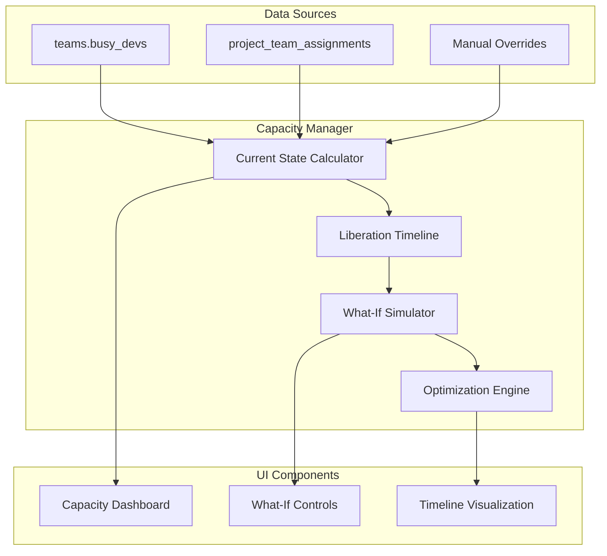
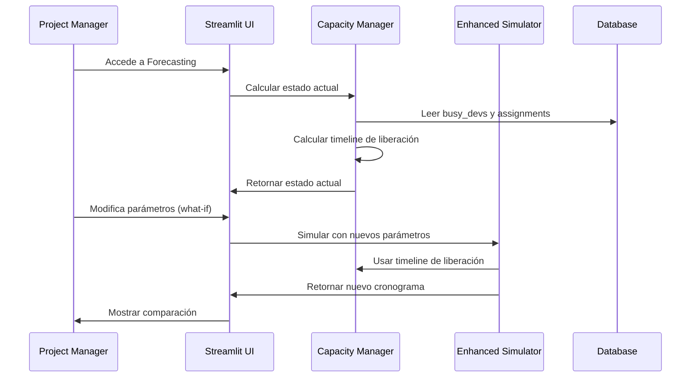

# Plan de Mejora del Sistema de Forecasting APE

## Problema Identificado

El sistema actual no puede determinar cuándo se liberan los desarrolladores ocupados (`busy_devs`), lo que limita la precisión del forecasting. Necesitamos un sistema que:

1. **Calcule dinámicamente** cuándo se liberan los devs ocupados
2. **Simule escenarios "what-if"** sin persistir cambios
3. **Proporcione visibilidad** del plan de liberación de recursos

## Solución Propuesta: Sistema de Tracking Dinámico

### Concepto Clave: "Simulation State"

En lugar de persistir ocupación en la DB, mantener un **estado de simulación** que se calcula en tiempo real:

```python
simulation_state = {
    'current_occupancy': {
        team_id: [
            {'devs': 2, 'end_date': '2024-01-15', 'project': 'Sistema X'},
            {'devs': 1, 'end_date': '2024-01-22', 'project': 'Sistema Y'}
        ]
    },
    'liberation_timeline': {
        '2024-01-15': {'team_id': 1, 'devs_freed': 2},
        '2024-01-22': {'team_id': 1, 'devs_freed': 1}
    }
}
```

## Arquitectura de la Solución

### 1. Nuevo Módulo: `capacity_manager.py`



### 2. Flujo de Trabajo Mejorado



## Implementación Detallada

### Fase 1: Capacity Manager Core

#### 1.1 Estructura de Datos para Ocupación Actual

```python
@dataclass
class CurrentOccupancy:
    team_id: int
    devs_occupied: float
    estimated_end_date: date
    project_name: str
    confidence: str  # 'high', 'medium', 'low'

@dataclass
class LiberationEvent:
    date: date
    team_id: int
    devs_freed: float
    source: str  # 'estimated', 'manual', 'calculated'
```

#### 1.2 Algoritmo de Cálculo de Estado Actual

```python
def calculate_current_state() -> Dict[int, List[CurrentOccupancy]]:
    """
    Calcula el estado actual de ocupación por equipo
    """
    current_state = {}
    
    for team in teams:
        occupancies = []
        
        if team.busy_devs > 0:
            # Opción A: Distribución uniforme (default)
            avg_end_date = estimate_average_liberation_date(team)
            occupancies.append(CurrentOccupancy(
                team_id=team.id,
                devs_occupied=team.busy_devs,
                estimated_end_date=avg_end_date,
                project_name="Proyectos en curso",
                confidence='medium'
            ))
            
            # Opción B: Usar assignments con status 'In Progress' (si existe)
            active_assignments = get_active_assignments(team.id)
            if active_assignments:
                occupancies = convert_assignments_to_occupancies(active_assignments)
        
        current_state[team.id] = occupancies
    
    return current_state

def estimate_average_liberation_date(team) -> date:
    """
    Estima cuándo se liberarán los devs ocupados
    Basado en duración promedio de proyectos históricos
    """
    avg_project_duration = get_average_project_duration(team.id)
    return date.today() + timedelta(days=avg_project_duration)
```

### Fase 2: Enhanced Simulator

#### 2.1 Integración con Estado Actual

```python
def enhanced_simulation(scenario_params=None):
    """
    Simulación mejorada que considera ocupación actual
    """
    # 1. Cargar estado actual
    current_state = calculate_current_state()
    liberation_timeline = build_liberation_timeline(current_state)
    
    # 2. Aplicar parámetros de escenario (what-if)
    if scenario_params:
        liberation_timeline = apply_scenario_changes(liberation_timeline, scenario_params)
    
    # 3. Simular proyectos futuros
    active_by_team = initialize_with_current_occupancy(liberation_timeline)
    
    # 4. Continuar con simulación normal...
    return simulate_projects(active_by_team)

def build_liberation_timeline(current_state) -> Dict[date, List[LiberationEvent]]:
    """
    Construye timeline de cuándo se liberan desarrolladores
    """
    timeline = defaultdict(list)
    
    for team_id, occupancies in current_state.items():
        for occ in occupancies:
            timeline[occ.estimated_end_date].append(
                LiberationEvent(
                    date=occ.estimated_end_date,
                    team_id=team_id,
                    devs_freed=occ.devs_occupied,
                    source='estimated'
                )
            )
    
    return dict(timeline)
```

### Fase 3: What-If Interface

#### 3.1 Controles Interactivos

```python
def render_whatif_controls():
    """
    Panel de controles para análisis what-if
    """
    st.subheader("🔮 What-If Analysis")
    
    # Scenario selector
    scenario = st.selectbox("Escenario Base", [
        "Estado Actual",
        "Optimista (+20% velocidad)",
        "Pesimista (-20% velocidad)",
        "Contratación (+2 devs)",
        "Personalizado"
    ])
    
    if scenario == "Personalizado":
        # Controles para modificar parámetros
        col1, col2 = st.columns(2)
        
        with col1:
            st.write("**Ajustar Prioridades**")
            projects = load_projects()
            new_priorities = {}
            for proj in projects:
                new_priorities[proj.id] = st.slider(
                    f"{proj.name}",
                    min_value=1,
                    max_value=len(projects),
                    value=proj.priority,
                    key=f"prio_{proj.id}"
                )
        
        with col2:
            st.write("**Ajustar Recursos**")
            teams = load_teams()
            team_adjustments = {}
            for team in teams:
                team_adjustments[team.id] = st.number_input(
                    f"Devs adicionales - {team.name}",
                    min_value=-team.total_devs,
                    max_value=10,
                    value=0,
                    key=f"devs_{team.id}"
                )
    
    return build_scenario_params(scenario, locals())

def render_comparison_view(baseline_results, scenario_results):
    """
    Vista de comparación lado a lado
    """
    col1, col2 = st.columns(2)
    
    with col1:
        st.write("**📊 Escenario Base**")
        render_results_table(baseline_results)
        
    with col2:
        st.write("**🎯 Escenario What-If**")
        render_results_table(scenario_results)
        
        # Métricas de impacto
        impact = calculate_impact_metrics(baseline_results, scenario_results)
        st.metric("Mejora en Tiempo Promedio", f"{impact.avg_time_improvement} días")
        st.metric("Proyectos Adelantados", impact.projects_accelerated)
        st.metric("Utilización Promedio", f"{impact.avg_utilization:.1f}%")
```

#### 3.2 Visualización de Timeline

```python
def render_capacity_timeline():
    """
    Timeline visual de liberación de capacidad
    """
    liberation_timeline = build_liberation_timeline(calculate_current_state())
    
    # Crear DataFrame para visualización
    timeline_data = []
    for date, events in liberation_timeline.items():
        for event in events:
            timeline_data.append({
                'date': date,
                'team': get_team_name(event.team_id),
                'devs_freed': event.devs_freed,
                'source': event.source
            })
    
    df = pd.DataFrame(timeline_data)
    
    # Gráfico de barras apiladas
    fig = px.bar(df, 
                 x='date', 
                 y='devs_freed', 
                 color='team',
                 title="Timeline de Liberación de Desarrolladores")
    
    st.plotly_chart(fig)
```

### Fase 4: Optimización Automática

#### 4.1 Algoritmo de Optimización

```python
def suggest_optimizations(current_scenario):
    """
    Sugiere optimizaciones automáticas
    """
    suggestions = []
    
    # 1. Detectar cuellos de botella
    bottlenecks = identify_bottlenecks(current_scenario)
    for bottleneck in bottlenecks:
        suggestions.append({
            'type': 'bottleneck',
            'team': bottleneck.team_name,
            'suggestion': f"Considerar reasignar {bottleneck.excess_demand} devs a {bottleneck.team_name}",
            'impact': f"Reduciría tiempo promedio en {bottleneck.time_savings} días"
        })
    
    # 2. Optimizar prioridades
    priority_optimization = optimize_priorities(current_scenario)
    if priority_optimization.improvement > 0:
        suggestions.append({
            'type': 'priority',
            'suggestion': "Reordenar prioridades para mejor flujo",
            'impact': f"Mejoraría tiempo promedio en {priority_optimization.improvement} días",
            'new_order': priority_optimization.suggested_order
        })
    
    # 3. Balanceo de carga
    load_balancing = suggest_load_balancing(current_scenario)
    suggestions.extend(load_balancing)
    
    return suggestions
```

## Estructura de Archivos Propuesta

```
app/modules/forecasting/
├── __init__.py
├── capacity_manager.py      # Core: gestión de capacidad actual
├── enhanced_simulator.py    # Simulador mejorado
├── whatif_analyzer.py       # Análisis what-if
├── optimization_engine.py   # Sugerencias automáticas
├── visualization.py         # Gráficos y timelines
└── forecasting_ui.py       # UI principal mejorada
```

## Métricas de Éxito

### KPIs del Sistema Mejorado

1. **Precisión de Estimación**: ±5 días vs. baseline actual
2. **Tiempo de Análisis**: <30 segundos para simular 20 proyectos
3. **Scenarios Evaluados**: Capacidad de comparar 3+ escenarios simultáneamente
4. **Optimización Automática**: Identificar 80% de cuellos de botella reales

### Casos de Uso Objetivo

1. **"¿Qué pasa si contratamos 2 devs más?"**
2. **"¿Cómo afecta cambiar la prioridad del Proyecto X?"**
3. **"¿Cuándo se liberarán recursos para el nuevo proyecto urgente?"**
4. **"¿Cuál es la mejor distribución de devs para minimizar tiempo total?"**

## Roadmap de Implementación

### Sprint 1 (1-2 semanas): Foundation
- [ ] Implementar `capacity_manager.py`
- [ ] Crear algoritmo de cálculo de estado actual
- [ ] Integrar con simulador existente

### Sprint 2 (1-2 semanas): What-If Core
- [ ] Desarrollar `whatif_analyzer.py`
- [ ] Crear controles básicos de escenarios
- [ ] Implementar comparación side-by-side

### Sprint 3 (1-2 semanas): Visualization & UX
- [ ] Timeline de liberación de capacidad
- [ ] Gráficos de utilización
- [ ] Métricas de impacto

### Sprint 4 (1-2 semanas): Optimization
- [ ] Motor de optimización automática
- [ ] Detección de cuellos de botella
- [ ] Sugerencias inteligentes

Este plan resuelve el problema fundamental que identificaste: **saber cuándo se liberan los recursos ocupados** y permite hacer análisis what-if sin necesidad de persistir datos temporales en la base de datos.