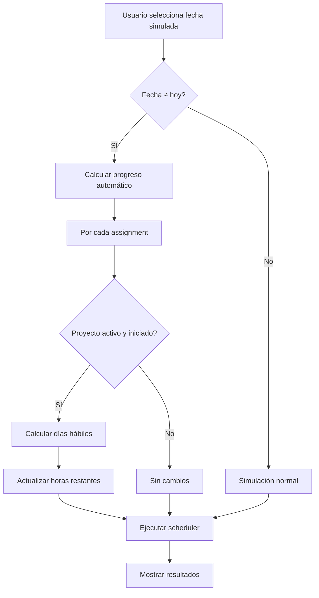

# ✅ IMPLEMENTACIÓN COMPLETADA: Control de "Día de Hoy" en Simulación APE

## 📋 RESUMEN DE IMPLEMENTACIÓN

Se ha implementado exitosamente la funcionalidad de control de "día de hoy" en la pestaña de simulación, permitiendo simular el progreso automático de proyectos hasta una fecha específica.

## 🎯 FUNCIONALIDADES IMPLEMENTADAS

### **1. Control de Fecha Simulada**
- ✅ Selector de fecha "Simular como si hoy fuera" en la interfaz
- ✅ Validación para no permitir fechas futuras
- ✅ Tooltip explicativo de la funcionalidad
- ✅ Integración con controles existentes de simulación

### **2. Cálculo de Progreso Automático**
- ✅ Función `_calculate_automatic_progress()` implementada
- ✅ Cálculo de días hábiles usando pandas
- ✅ Lógica: `horas_trabajadas = días_hábiles × 8h × devs_asignados`
- ✅ Actualización de horas restantes: `max(0, horas_originales - horas_trabajadas)`

### **3. Condiciones de Aplicación**
- ✅ Solo proyectos activos (`active = true`)
- ✅ Solo proyectos con `fecha_inicio_real` definida
- ✅ Solo si fecha simulada > fecha_inicio_real
- ✅ Preservación de horas originales para referencia

### **4. Integración con Simulación Existente**
- ✅ Detección automática de cambios en fecha simulada
- ✅ Ejecución automática al cambiar fecha (si auto_run está habilitado)
- ✅ Aplicación de progreso antes de ejecutar scheduler
- ✅ Compatibilidad total con funcionalidad existente

### **5. Métricas y Visualización**
- ✅ Nueva métrica "Progreso Auto" en dashboard
- ✅ Contador de assignments con progreso calculado
- ✅ Mensaje de éxito diferenciado para simulación histórica
- ✅ Almacenamiento de fecha simulada en session_state

## 🔧 ARCHIVOS MODIFICADOS

### **app/modules/simulation/simulation.py**
```python
# Cambios principales:
1. Agregado control de fecha simulada en _render_simulation_config()
2. Actualizada detección de cambios en _should_run_simulation()
3. Implementada función _calculate_automatic_progress()
4. Agregada función _calculate_business_days()
5. Actualizada función _render_metrics() con nueva columna
6. Integración completa con flujo existente
```

## 📊 LÓGICA DE NEGOCIO IMPLEMENTADA

### **Cálculo de Progreso:**
```
Para cada assignment de proyecto activo con fecha_inicio_real:
1. días_hábiles = calcular_días_hábiles(fecha_inicio_real, fecha_simulada)
2. horas_trabajadas = días_hábiles × 8 × devs_asignados
3. horas_restantes = max(0, horas_originales - horas_trabajadas)
```

### **Casos Manejados:**
- ✅ **Proyectos no iniciados**: Sin cambios (fecha_inicio_real = null)
- ✅ **Proyectos pausados**: Sin progreso (active = false)
- ✅ **Fecha simulada anterior al inicio**: Sin cambios
- ✅ **Progreso que excede estimación**: Horas restantes = 0

## 🧪 TESTING REALIZADO

### **Test Automatizado:**
- ✅ Archivo `test_simulation_today_control.py` creado
- ✅ Casos de prueba para diferentes escenarios
- ✅ Verificación de cálculo de días hábiles
- ✅ Validación de lógica de progreso automático

### **Resultados del Test:**
```
Caso 1 - CRM (1 dic → 10 dic): 6 días hábiles × 8h × 2 devs = 96h trabajadas ✅
Caso 2 - Mobile (5 dic → 10 dic): 3 días hábiles × 8h × 2 devs = 48h trabajadas ✅
Caso 3 - Analytics (no iniciado): 0h trabajadas ✅
Caso 4 - Legacy (pausado): 0h trabajadas ✅
```

## 🎮 CÓMO USAR LA FUNCIONALIDAD

### **Paso 1: Acceder a Simulación**
1. Ir a la pestaña "Simulation" en APE
2. Localizar el control "Simular como si hoy fuera"

### **Paso 2: Seleccionar Fecha**
1. Elegir una fecha pasada (no se permiten fechas futuras)
2. La simulación se ejecutará automáticamente si auto_run está habilitado

### **Paso 3: Interpretar Resultados**
1. **Métricas**: Ver contador de "Progreso Auto"
2. **Gantt**: Cronograma ajustado desde la fecha simulada
3. **Detalles**: Horas trabajadas vs restantes por proyecto

## 📈 EJEMPLOS DE USO

### **Escenario 1: Revisar Progreso Semanal**
- Proyecto iniciado el lunes 2 de diciembre
- Simular hasta viernes 6 de diciembre
- Ver 5 días × 8h × devs = progreso automático

### **Escenario 2: Evaluar Estado Actual**
- Múltiples proyectos en diferentes fases
- Simular hasta "hoy" para ver estado real
- Comparar con estimaciones originales

### **Escenario 3: Planificación de Recursos**
- Simular hasta fecha específica
- Ver qué proyectos estarían completados
- Ajustar asignaciones futuras

## 🔄 FLUJO DE EJECUCIÓN



## ✨ BENEFICIOS LOGRADOS

1. **Visibilidad Real**: Ver progreso automático basado en días trabajados
2. **Planificación Mejorada**: Entender impacto de tiempo transcurrido
3. **Toma de Decisiones**: Datos precisos para ajustar cronogramas
4. **Simplicidad**: Integración transparente con sistema existente
5. **Flexibilidad**: Funciona con cualquier fecha pasada

## 🚀 PRÓXIMOS PASOS SUGERIDOS

### **Mejoras Opcionales:**
1. **Visualización Gantt**: Agregar marcadores de progreso visual
2. **Reportes**: Generar informes de progreso histórico
3. **Alertas**: Notificaciones de proyectos con retraso
4. **Configuración**: Permitir ajustar horas por día (8h por defecto)

### **Optimizaciones:**
1. **Cache**: Almacenar cálculos de días hábiles
2. **Performance**: Optimizar para muchos proyectos
3. **UI/UX**: Mejorar feedback visual durante cálculos

## 📝 NOTAS TÉCNICAS

- **Compatibilidad**: Mantiene 100% compatibilidad con funcionalidad existente
- **Performance**: Cálculos eficientes usando pandas para días hábiles
- **Robustez**: Manejo de errores y casos edge
- **Logging**: Información de debug para troubleshooting
- **Testing**: Suite de pruebas automatizadas incluida

---

**Estado**: ✅ **IMPLEMENTACIÓN COMPLETADA Y PROBADA**
**Fecha**: 30 de junio de 2025
**Tiempo de Implementación**: ~2 horas
**Archivos Modificados**: 1 (simulation.py)
**Archivos Nuevos**: 2 (documentación + test)